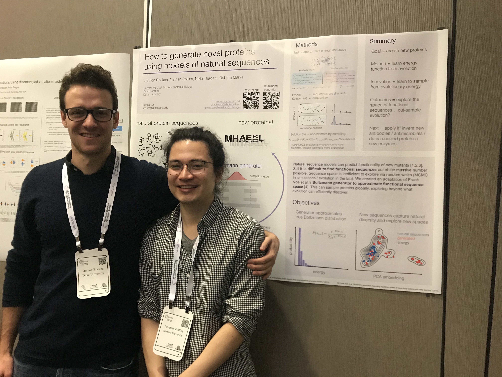

I am really glad my finals schedule allowed me to spend a week in Vancouver at NeurIPS 2019. NeurIPS provided me with a bird’s eye view of current progress in ML and what it takes to publish at a top ML conference. I also met some wonderful people and left with a number of new research directions like a kid finishing trick-or-treating on Halloween with an assortment of candy.

For my own retention and the curiosity of friends who weren’t able to attend the conference, I am highlighting the research I found the most exciting while also summarizing my overall thoughts on the conference and state of ML.

Disclaimer: NeurIPS is a multitrack conference so there were many talks and posters that I didn’t get the chance to see. What I find interesting is also heavily biased by my background and research interests. This is also my first ML conference or major academic conference in general.

## Table of Contents:

# Exciting avenues

Between the poster sessions and spotlight talks, NeurIPS a sampling of a large number of different and exiciting research areas here they are below grouped by general category with a short summary and link to the paper (those in bold I found particularly great):

MAKE SURE I GO THROUGH THE SPOTLIGHTS AND ALSO LINK TO THEM.
Bold the best too

* Generative Models:
    * Energy based models
	    * **[Your classifier is secretly an energy based model and you should treat it like one](https://arxiv.org/pdf/1912.03263.pdf) - any classification model $$p(y|x)$$ 
        can be used to also learn $$p(x,y)$$ and $$p(x)$$ by utilizing recent developments in efficiently approximating the intractable partition function. What is so compelling about this hybrid neural network is that it delivers on the promise of generative models being useful for supervised learning, which has not been particularly true in the past. This paper was not presented at NeurIPS but was publicized during it and I found it really interesting. It also builds off of other papers that were presented at the conference.**
	    * [Implicit Generation and Generalization with Energy Based Models](https://arxiv.org/pdf/1903.08689.pdf) - shows similar results to the above paper on the ability to perform SOTA out-of-distribution classification and adversarial robustness. 
        * [Energy-Inspired Models: Learning with Sampler-Induced Distributions](http://papers.nips.cc/paper/9057-energy-inspired-models-learning-with-sampler-induced-distributions.pdf) - This paper has the same motivation but a more in depth exploration of different techniques to approximate the partition function. 
        * Given all of these recent papers, it would be worth doing a comparative analysis of their performance and optimization methods, something may be gleaned by a combination of their techniques. Ultimately, as the first paper says, while energy based models are a real pain to train, they have a number of advantages that are compelling enough to make further investigations of them and improvements in their training them worthwhile.
	* [Generative Modeling by Estimating Gradients of the Data Distribution](http://papers.nips.cc/paper/9361-generative-modeling-by-estimating-gradients-of-the-data-distribution.pdf) - this paper presents a new approach to generative modelling in the form of using gradients $$\nabla_x \log p_{data}(x)$$ to learn the directions towards higher probability density and using Langevin dynamics to sample from them.
    * Symmetry adapted generation of 3d point sets for the targeted discovery of molecules
	* Discrete Molecular Generation - Ryan adams
	* A Model to Saerch for Synthesizable Molecules.
	* BIVA: A very deep hierarchy of latent variables for generative modelling.
	* Generative Well intenetioned networks
	* Variational Mixture-of-Experts Autoencoders for Multi-modal deep generative models
	* Generating Diverse High Fidelity Images with VQ-VAE2

 

* Normalizing flows:
    * Discrete Normalizing Flows - normalizing flows now for discrete data, in order to be invertible these are significantly less powerful because they can only permute data (think shifting histogram bars but not being able to combine them) https://arxiv.org/pdf/1905.10347.pdf
    * Neural Spline Flows - highly expressive normalizing flows that are also stable to train https://arxiv.org/pdf/1906.04032.pdf 
    * i-ResNet improvements - includes Russian roulette unbiased estimator, a new “LipSwish” activation function that doesn’t have saturated second derivatives, and performance improvements. These models are really powerful and don’t require data splitting for their invertibility, which has been shown to be important https://arxiv.org/abs/1906.02735
    * Graph Normalizing Flows - https://arxiv.org/pdf/1905.13177.pdf
    * Invert to learn to invert - NEED TO WRITE A SUMMARY https://papers.nips.cc/paper/8336-invert-to-learn-to-invert.pdf

 

* Neural ODEs:
    * Stochastic ODEs
    * Time based modelling

 

* Reinforcement Learning: 
	* Backward RL 
	* MuZero
	* No Press Diplomacy: Modeling Multi-Agent Gameplay
	* David Ha’s numerous papers
	* Biases for Emergent Communication in Multi-agent reinforcement learning
	* Finding Friend and Foe in Multi-Agent Games
	* MAVEN: Multi-Agent Variational Inference
	* Multi-Agent Common Knowledge Reinforcement Learning

 

* Sequence Models: 
    * Are Sixteen Heads Really Better than One? 

* Graph models: 
    * Efficient Graph Generation with Graph Recurrent Attention Networks - https://arxiv.org/pdf/1910.00760.pdf
    * Hyperbolic Graph Neural Networks

* Segmentation: 
    * Neural Diffusion Distance for Image Segmentation

* Gaussian Process: 
    * Exact Gaussian Processes on a Million Data Points - looked at how much you could get away with subsampling or other faster approximations. 

* Misc Self-Routing Capsule Networks

 

*	Optimization: 
    * Tensor Monte Carlo. 
    * Gradient Based Adaptive Markov Chain Monte Carlo
    * Sample adaptive MCMC
    * The Impliic Metropolis Hastings Algo (should I even add this one). 
    * Amortized Bethe Free Energy Minimization for Learning MRFs
    * Computational separations between sampling and optimization
    * MetaInit: Initalizing learning by learning to initialize
    * Meta Architecture Search
    * Hyperparameter Learning via Distributional Transfer
    * Which Algorithmic Choices Matter at Which Batch Sizes? Insights from a noisy quadratic model 

 

* Evaluation:
    * New generation dataset
    * TAPE
    * Wasserstein distance? 

 

* Inference
    * Sparse Variaitonal Inference: Bayesian Coresets from Scratch 
    * Bayesian Layers (Dustin Tran)
    * Optimal Sparse Decision Trees 

 

* Neuroscience: 
    * DeepMind backprop
    * Harvard similarity
    * Mutual Info training
    * Brain emergence
    * Fixed points
    * Patterns between word embeddings and MIR representations

 

* Robustness: 
    * Likelihood Ratios for Out-of-Distribution Detection
    * Johnny’s poster

 

* Benchmarks: 
    * OpenAI safety gym
    * Phyre: FAIR

# The scale

There were ~13,000 people attending NeurIPS this year (how does this relate to the past?) with … accepted papers being presented as posters. These papers were spread across two sessions per day for three days with ~… posters per session. Here is an example of the topics in one poster session: 

Grouped by topic, there were often multiple posters from different groups all trying to tackle the same problem with variants of the same approach. And with a paper acceptance rate of ~20% (cite medium article on this) and a number of other major machine learning conferences spread across the year, this was just the tip of the iceberg. 

In this light, the conference often felt overwhelming in how large and competitive the field of ML is, how much research there is to keep abreast of, and the difficultly of doing research that someone else hasn’t thought of or isn’t already doing. 

# Climbing the tree of discovery

In light of the number of papers covering very similar topics, I felt like a lot of the work at NeurIPS was 1 to N rather than 0 to 1 and not as exciting as I had expected. A large amount of the research felt like taking the existing gold standard and tweaking it in some small way to boost performance by 0.1% against benchmarks (in the best case improving performance across every benchmark rather than just a few of them). Yes, lots of 0.1% improvements all combined can combine to orders of magnitude gains but only if they are independent of each other and cumulative. What was troubling was that many of these improvements were small changes to existing frameworks (eg. putting a VAE inside of an RNN) and conflicted with each other. And while many of these ideas may be worth trying and we may see an ultimate survival of the fittest, I worry about an overall focus on doing something slightly different to optimize for publications and for novelty’s sake rather than some underlying theoretical motivation or hypothesis that can generalize. Basically, I don’t know how much of this work will survive or have ended up being useful, and I don’t know how fundamental this is to the scientific process but worry about misaligned incentives and it is painful to see to much effort from so many groups amounting to nothing, especially when this is just the tip of the iceberg of things that actually worked to a certain degree and with the most rigour. It is additionally confusing as a customer of these methods and approaches, uncertain which of them are worth the effort to actually use.
, and  I can’t see many of these papers being cited because the time it would take for a researcher to read the paper and implement it would probably be more than the returns they would get in performance. From these papers one could have made a very long list of if else statements for every think to keep in mind about their learning rate, batch size, optimizer, layer normalization, etc etc etc in order to improve performance and training time by a percentage point each. The other realm in which there was an overwhelming number of different approaches all showing marginal and often confliciting improvements was in reinforcement learning.  This opinion came from a few experiences: 

Beyond doing highly creative and field transforming work, Dr. David Duvenaud while at one of his labs’ posters on neural ODEs said unsolicited that anyone interested in their new method should first try a much simpler to implement model they benchmarked against because it would perform almost as well for most cases. Beyond creating entirely new architectures that can lead to serious performance differences, this pragmatism was wonderful to see. 

On the other end of the spectrum, one poster by .. analyzed the effect that changing batchsize had on the generalization ability of a neural network. The results showed that having a lower batch size increased the generalization ability of the neural network. The poster did not state the hypothesis that motivated them to perform these tests or whether or not the results were suprising in this light. More concerningly, when I stated that the results seemed counterintuitive to me footnote:(having a larger batch size reduces noise in the gradient calculation leading to a more accurate gradient step that should lead to faster and more accurate convergence) and asking what the intuition behind the results were, the author explained that they believed having more stochasticity led to the escape of local minima and ultimate settling in a deeper minima. This was strange to me for two reasons: firstly, the number of local minima present for a neural network declines exponentially with respect to the number of parameters in the network, this is because for a particular point to be a local minima it must have an all positive Hessian which has a probability $$\frac{1}{2^{|W|}}$$ 
where $$W$$ are the network parameters (Goodfellow et al.). Secondly, neural networks are frequently not trained to convergence, using early stopping to prevent overfitting or showing good enough performance that they are stopped while reductions in the learning rate still appear. In this light, more stochastic gradient descent should not be escaping local minima and it seems like it would be just as likely to take updates that move you to a worse region of space than a good one. These confusions were resolved two days later when a different poster presented conflicting results showing that there was a positive relationship between batchsize and generalization (particularly, having a larger batch size helped in the later stages of training at finding deeper regions of the optima that performed better)! Raising the clash with the previous poster, the presenter cited .. and the importance of retuning all of a networks hyperparameters with respect to every change in batch size. I have since gone back and confirmed that ... failed to do this making their results unreliable[^batchsize]. 

EG SMARTER MONTE CARLO. SHOULD WE CARE? HOW FAST IS IT AND WHAT ARE THE TRADEOFFS COMPARED TO VI? AND THAT NOBODY WILL DO THE WORK TO FIGURE OUT, ENOUGH OTHER PROBLEMS. EG NEED EVERYONE FROM NEURIPS ON ONE GOOGLE DOC IRONING OUT AGREEMENTS AND DISAGREEMENTS. 

I am certain I’m being heavily biased in a few ways: 1. Some of the work that I found less exciting on topics like convergence rates and generalization bounds was because I didn’t understand the underlying theory and background motivations for. 2.  Being relatively new to ML and Deep Learning, the rate at which I learn highly impactful new methods will inevitably decline. For example, reading Goodfellow et al.’s Deep Learning textbook gave me a whirlwind tour of only the highlights of decades of innovation and progress, you don’t get to learn about new architectures like the CNN or RNN every day. As we pluck the lowest hanging fruit of ML discoveries, the fruit higher is not only higher to reach but also presents many more branches to be climbed. 3. Deep Learning has accumulated a great deal of debt in the form of better interpretability and analysis that is now being paid off in order to make future. Part of this debt is also in just making machine learning smoother. For example, a PhD student at Edinburgh presenting a new powerful normalizing flow architecture acknowledged how previous architectures including RealNVP and Glow were highly unstable in training and when they reproduced Glow, the implementation detail of adding … was incredibly important yet never mentioned in the paper and only in the code base. ML and deep learning in particular are highly complex with many difficult implementation details that are small on their own but incredibly important collectively. 4. This is science at work with all of its trials, errors, and unseen future serendipitous discoveries that could emerge from having researchers getting their hands dirty with these models and tinkering on them.

In light of these biases, I feel like a majority of the work at NeurIPS is important and impactful and most of my sentiment is actually just seeing science at work and being ignorant about other fields. However, this experience has been a healthy reminder to prioritize a few things in my own research because there is a finite number of projects I can work on in my lifetime and I want to maximize the probability that my work is important and impactful: 
1.	Aim for significant breakthroughs in methodology or application, don’t settle for marginal improvements. 
2.	Clearly state the problem being addressed and hypotheses being tested. What are the underlying implicit assumptions and inductive biases? How do these relate to the problem at hand? 
3.	Think of solutions that are dramatically outside of existing methods and approaches.
4.	Write down all the possible ways the idea could fail or how it even if it worked it would still be suboptimal to other approaches.  
5.	Account for usability and practicality, ease of implementation and application is a real consideration that must be balanced. 
6.	Ensure that work done, especially if more theoretical, is as accessible to application as possible, for example writing easy to use software packages.
7.	Benchmarks and review papers are incredibly important for consolidating all of the different research avenues being pursued.

How this all relates to my temporal firing idea. We are bad at modelling temporal data - what does David Ha mean by this? What are datasets that can test this? We also want additional improvement in RL. Why does this work matter? Applying more ideas from neuroscience to deep learning. I believe that the refractory period constraint may in fact be beneficial. I also believe that spike trains are v important for modelling information. Q: how does this differ from having a very deep network? And esp as it will require many more forward passes. What are all the ways it could fail? 
-	Too computationally expensive
-	Unable to learn to backprop through something that happened 100 firings ago for a reward. 

Ideas/concepts. Keep track of refractory period even across different prediction steps. Store all of the firing activities in a given setting. Don’t forget the other motivation for fidning new ways of forming connections and communicating. 
I will need to use reinforce to reward everything because there is a discrete change in time between one firing and another. How can I make this continuous? I cant model it as a spiking RNN because later neurons would get everything at the same time from the previous layer. 
Will be easiest for now to use reinforce. 

# The power of the ML Culture

Reflecting on the rate at which ML has progressed (it is crazy how much of Goodfellow et al’s Deep Learning book published in 2016 is now out of date!) I believe that the conference publication format and arXiv have been highly influential factors. The fact that un-peer reviewed work can be published for free and immediately circulated through ML twitter and cited numerous times within months before being peer-reviewed, published and presented at a conference a few months later is wild compared to other fields that keep their work secret until it is published in a major journal often one or two years later and then living behind a paywall.  Openreview is also an incredibly transparent and double blinded way to share research and see the peer review process at work. 

# My poster!

Dr. Debora Marks suggested that Nathan Rollins, Nikki Th… and I put together a poster on our work in progress for the Learning Meaningful Representations of Life (LMRL) conference and we did! It was a lot of fun presenting and getting feedback/ideas from others.

Photo: 

Nathan Rollins and me. We are the same age but one of us is five years into their Harvard PhD!  Dr. Nikki Thadani unfortunately missed out on the NeurIPS lottery and was unable to attend. 

Here is the poster in all its glory: 

And NeurIPS was wonderful for acquiring new ideas that I am excited to explore as our project moves forward. 

-------

First Main Day (Tuesday):

Very overwhelming. So many papers and people. Easy to think that some of it doesnt matter and then remember that it is NeurIPS and a very big deal. 

The papers I found most interesting and want to go back and read in detail broken out by session are: 

Poster Session 1: 
Duvenaud Graph autoregressive network
Biological learning algorithm for similarity score
Need to learn about Wasserstein distance
Analysis of VAE inside of RNN performance
Smaller batch sizes leading to better generalization
RL Safety exploration using A* search and high enough Gaussian process prob that it is both safe and informative. 
Deep mind mirror learning as a replacement to backprop. 

Single cell data, want to look more at these datasets and why single cell matters, also the different assays that you can use flow cytometry for. 

Spotlight talks: 

Score based density estimation
More powerful invertible networks eg. i-ResNet
GANs used in unique ways (Fisher vectors) or trained in unique ways (with likelihood)
Energy based models from classifiers or otherwise
Alex Foster Bayesian optimization
New form of image segmentation
New way to evaluate the quality of generative models for images. 

Poster Session 2: 
Large scale neural network loss landscapes
MMD gradient flow
David Ha’s papers

Thanks to Dr. Debora Marks and her lab for the research opportunities and funding that brought me to NeurIPS. Thanks also to the Robertson Scholars Leadership Program for their additional funding.

Footnotes: 

[^batchsize]: in light of this research, make your batch size as large as your processor permits! I realized that I never really know how large a batch my processor can hold and often keep doubling the batch size. Sometimes I find the max but this is slow, other times I get bored and ever learn the upper limit. The presenter said that he does the same but looks at -nvidia-smi to see the GPU usage, I don’t know how to do this on the Harvard Medical School slurm system and so it seems like someone should make a simple pip package that can look at your data and GPU/CPU and approximate what the largest batchsize it can handle is.
