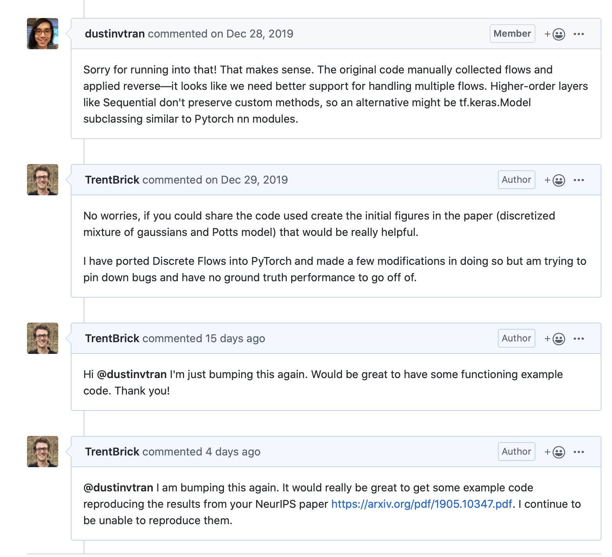
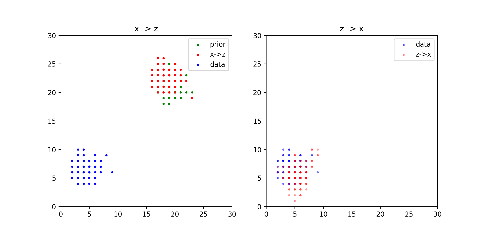
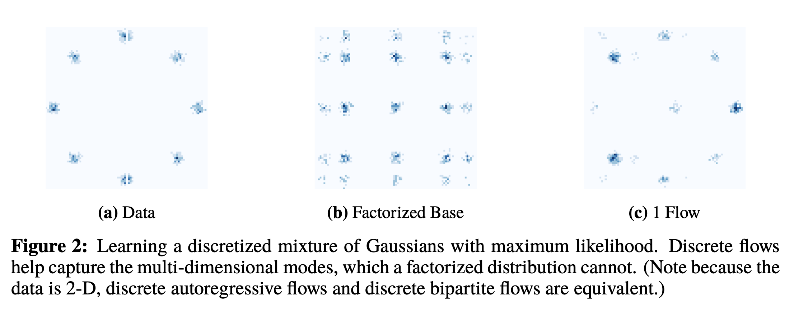

TLDR; I couldn't get the edward2 version of Discrete Flows working so I ported all of it to PyTorch and have a demo working. However, I have been unable to reproduce any of the more complex toy problems presented in the paper.
Link to the GitHub repo: <https://github.com/TrentBrick/PyTorchDiscreteFlows>
--------

Excited by the introduction of Discrete Normalizing Flows with the NeurIPS 2019 paper: "Discrete Flows: Invertible Generative Models of Discrete Data", by Dustin Tran et al. <https://arxiv.org/pdf/1905.10347.pdf>, I tried using it with the code provided in [edward2](https://github.com/google/edward2/tree/master/edward2/tensorflow/layers#4-reversible-layers) but could not get any of it working for two reasons: 

1. There was no demo code applied to any toy examples. In fact even the demo code [here](https://github.com/google/edward2/tree/master/edward2/tensorflow/layers#4-reversible-layers) turned out to be non-functional psuedo-code as I flagged in [this bug report](https://github.com/google/edward2/issues/148). 
2. I found TensorFlow2 and Keras to be incredibly unwieldy, this has been documented by many others, most amusingly and relatably [here](https://nostalgebraist.tumblr.com/post/189464877164/attention-conservation-notice-machine-learning).

Given how opensource the ML community is, I was disappointed there was no real documentation on how to use the code and no opensourced example code used to reproduce even the basic examples in the original paper. Moreover, even after asking a number of times for this example code to be shared, all I got were crickets... This is particularly concerning because I have since been unable to reproduce the figures in the paper.

"15 days ago" was January 16th and "4 days ago" was January 27th.

After getting no response at the end of December I decided to port all of the code over to PyTorch where at least I wouldn't want to rip my eyeballs out trying to debug it. This took a number of modifications and I have since (finally) gotten a very simple example of the code working.
To my knowledge this is the first working and accessible implementation of Discrete Normalizing Flows and in PyTorch no less! I hope someone else finds this code useful for their research. Link to the GitHub repo: <https://github.com/TrentBrick/PyTorchDiscreteFlows>

In this toy example the discrete flow learns to map the 2D gaussian data up to its 2D Guassian prior that is shifted in the space. When generating samples from the latent space these are mapped back down to the data distribution. 

Something that is concerning me more than the lack of any opensource examples is that with my implementation I have been unable to produce examples like those from the original paper. Here is Figure 2 from the paper: 

