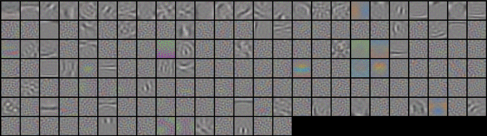

*Norming your weights and an inner loop for activations are important too.*

---

*Why should you care?* Sparse coding is one of the most promising ways to fight [superposition](https://transformer-circuits.pub/2022/toy_model/index.html) and increase model interpretability.

---

I myself have fallen into the trap of thinking that [sparse coding](https://en.wikipedia.org/wiki/Sparse_dictionary_learning) simply requires slapping an $$L_1$$ penalty on neuron activations. Formally, adding a term to the loss function:

$$\lambda \sum_{a \in A} |a|$$

where $$\lambda$$ is the coefficient that weights this term in the loss function and $$A$$ is the set of all neuron activations across the entire network.

There are two other crucial parts to sparse coding that aren't as discussed and have subtle importance:
1. Constraining weights from becoming too small.
2. Inner loop for activation values.

Neither of these components are novel but I flag them as easy to forget and share some results where applying them is subtly important.

First, the network can cheat and escape its $$L_1$$ activation penalty by just making its weights smaller. As a result, you have to either force the neuron to have fixed weight norms (re-adjusting them after every training step) or introduce another loss term that penalizes the weights from being too small! E.g. $$\alpha \sum{w in W} 1/||w||^2$$ note that this penalty is the inverse of a weight decay $$L_2$$ penalty that is typically applied and implicit to some optimizers like SGD!

Interestingly, if you ignore the above and allow for the network to shrink its weights, the $$L_1$$ activation penalty can still result in more model sparsity. However, in an reconstruction task with a simple, single hidden layer auto-encoder, the model learns biological receptive fields (Gabor filters) **if and only if** the weight norms are constrained. This seems important for trying to remove [polysemantism](https://transformer-circuits.pub/2022/toy_model/index.html) and increase [model interpretability](https://transformer-circuits.pub/2022/solu/index.html).

It is an open question to me the settings in which this weight norm constraint will harm performance and if the previous layer/input also needs to be normed.

<div align="center">
  
  <br>
  <em>Receptive fields of the neurons activated by a random CIFAR10 input. The striped lines are Gabors and they only appear when the norms of the weights are restricted. Otherwise there are only texture like patterns that form.</em>
</div>

Traditional sparse coding has an inner loop optimization of the neuron activation values. Analogous to an expectation maximization algorithm, it first finds the optimal activities, given the current weights, and then it updates the weights. Taking a derivative of a mean-squared error reconstruction loss with respect to the activations reveals an interesting term:

This term implicitly de-correlates the neuron weights and is a form of "explaining away". Explaining away reduces the activity of neurons that are redundant with others that are already active, while facilitation encourages co-activation of neurons encoding a common structure such as a contour.

We can model explaining away and facilitation with an additional weight matrix $G \in \mathbb{R}^{m \times m}$ (recall $m$ is the number of neurons) that we run in a recurrent inner loop. Our one hidden layer network becomes:

\begin{align}
    \boldsymbol{\mu}_0 &= W_e\tilde{\mathbf{x}}+\mathbf{b}_e \nonumber \\
    \mathbf{z}_{t} &= \text{ReLU}(\boldsymbol{\mu}_{t}) \nonumber \\
    %\mathbf{z}_0 &= \mathbb{Z}^m \nonumber \\
    \Delta \boldsymbol{\mu} &= \big( \boldsymbol{\mu}_0 - G \mathbf{z}_t \big ) - \boldsymbol{\mu}_t \nonumber \\
    \boldsymbol{\mu}_{t+1} &= \boldsymbol{\mu}_t + \gamma  \Delta \boldsymbol{\mu} \nonumber \\
    \hat{\mathbf{x}} &= W_d \; \text{ReLU}(\boldsymbol{\mu}_{t^*})+\mathbf{b}_d,
    \label{eq:ExplainAway}
\end{align}

where $$t$$ increments from 0 to $$t^*$$ as the number of iterations we want the inner loop to optimize neural activity and $$\gamma$$ is the size of the update step. In the simplest case where $$t^*=1$$ and $$\gamma=1$$, we do a single forward pass through this circuit that is analogous to a residual connection before the activation function. More generally, the value of $$t^*$$ can be thought of as the number of recurrent connections that all originate from $$\boldsymbol{\mu}_0$$ and end after every update to $$\mathbf{z}$$. The original Eq. \ref{eq:HiddenLayerOG} is a special case where $$t^*=0$$. This use of $$G$$ learnt with backpropagation was first explored in \cite{YeCunSparseCodingApprox}.

When weight norms are restricted this method had no effect (for CIFAR10 reconstruction). But if weight norms are neglected then it leads to much higher and faster levels of sparsity with fewer dead neurons. Meanwhile, In cases were $$L_1$$ penalty is too high it was also able to facilitate (the opposite of explaining away).

---

**Summary:**

---

*Thanks to ... for helpful comments and discussion. All remaining errors are mine and mine alone.*

### Footnotes
* footnotes will be placed here. This line is necessary
{:footnotes}
[^Foot1]: Bloop

### Citation

If you found this post useful for your research please use this citation:
```
@misc{SparseCodingMoreThanL1,
  title={Sparse Coding is more than an L1 Activation Penalty},
  url={https://www.trentonbricken.com/Sparse-Coding-Beyond-L1/},
  journal={Blog Post, trentonbricken.com},
  author={Trenton Bricken},
  year={2023}, month={January}}
```

---
