*My favourite questions from David MacKay's [Information Theory, Inference and Learning Algorithms](https://www.inference.org.uk/itprnn/book.pdf).*

---

This post is still growing and I need to write answers to more of the questions but in an effort to not let good be the enemy of perfect and to motivate me to get back to this textbook I am making this post live now!

I am really enjoying reading David MacKay's [Information Theory, Inference and Learning Algorithms](https://www.inference.org.uk/itprnn/book.pdf) which is available to read online for free.

The book has a number of great exercises in each chapter and I thought I would share a running list of my favourites. (I think and hope that this is legal as I am giving full credit to David MacKay and not profiting off of this, esp as the book is already free online).

I list the questions by chapter and the answers in a lower down section. I also add some of my own questions where I think they would be useful to check the understanding of certain concepts/equations which are covered in the book before questions leveraging them are asked. My questions are denoted (M#), questions from the book by (Chapter#.Question#).

I have to finish the remainder of the book and will be posting more of my favourite questions here!

Click on the question number to be linked to the answer!

## Questions

[M1](https:/trentbrick.github.io/InfoTheory/#A1). What is the information content of an unbiased dice roll?

[M2](https:/trentbrick.github.io/InfoTheory/#A2). What are the equations for expectation and variance of a Random Variable?

[2.16](https:/trentbrick.github.io/InfoTheory/#216) (hint: use the Central Limit Theorem)

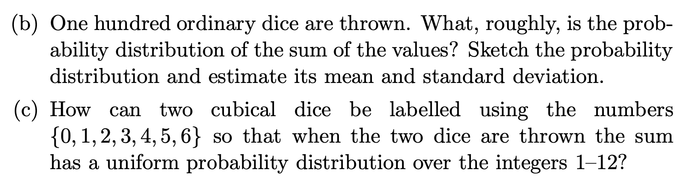

[M3](https:/trentbrick.github.io/InfoTheory/#A3). A coronavirus serology test (for having previously had an infection) has a 98% specificity and 95% specificity. Your mother, an upstanding citizen who has obeyed quarantine rules, takes the test and it comes back positive. What is the probability your mother has coronavirus?

[M4](https:/trentbrick.github.io/InfoTheory/#A4). "Frequentists argue that you can only use probabilities to describe the ____ of outcomes ____ experiments"

[M5](https:/trentbrick.github.io/InfoTheory/#A5). "Forward probability problems involve a _____ model that describes a process that is assumed to give rise to some data"

[M6](https:/trentbrick.github.io/InfoTheory/#A6). "Like forward probability problems, inverse probability problems involve a _____ of a process, but instead of computing the probability distribution of some quantity produced by the process, we compute the ______ of one or more of the _______ in the process, given the observed variables. This invariably requires the use of ______."

[M7](https:/trentbrick.github.io/InfoTheory/#A7). What is the Bayesian response to Frequentist claims that they make  assumptions about the prior?

[M8](https:/trentbrick.github.io/InfoTheory/#A8). What is Jensen's Inequality?

[M9](https:/trentbrick.github.io/InfoTheory/#A9). What is Kullback-Leibler Divergence?

[2.25](https:/trentbrick.github.io/InfoTheory/#225) Take the hint into account but there is another (less elegant) way to solve it!

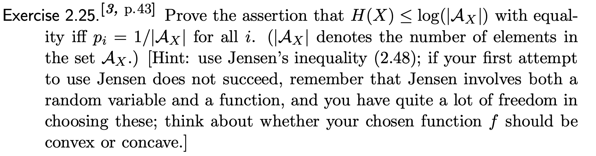

[3.8](https:/trentbrick.github.io/InfoTheory/#38) Try to calculate the probabilities of being correct under the different scenarios too.

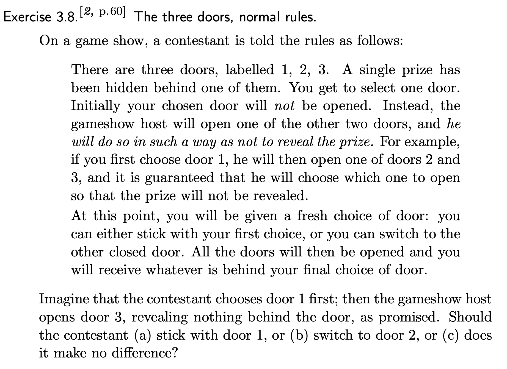

[3.9](https:/trentbrick.github.io/InfoTheory/#39)

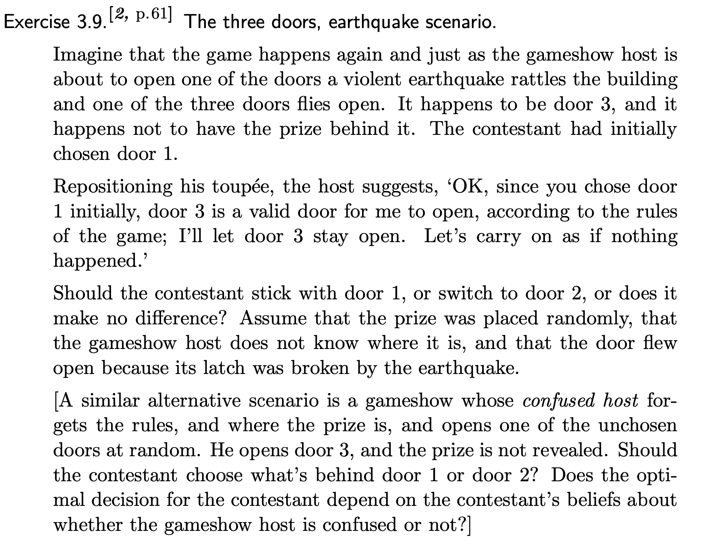

[4.1](https:/trentbrick.github.io/InfoTheory/#41) First try to find what the minimum number of necessary weighting steps is for the optimal solution.

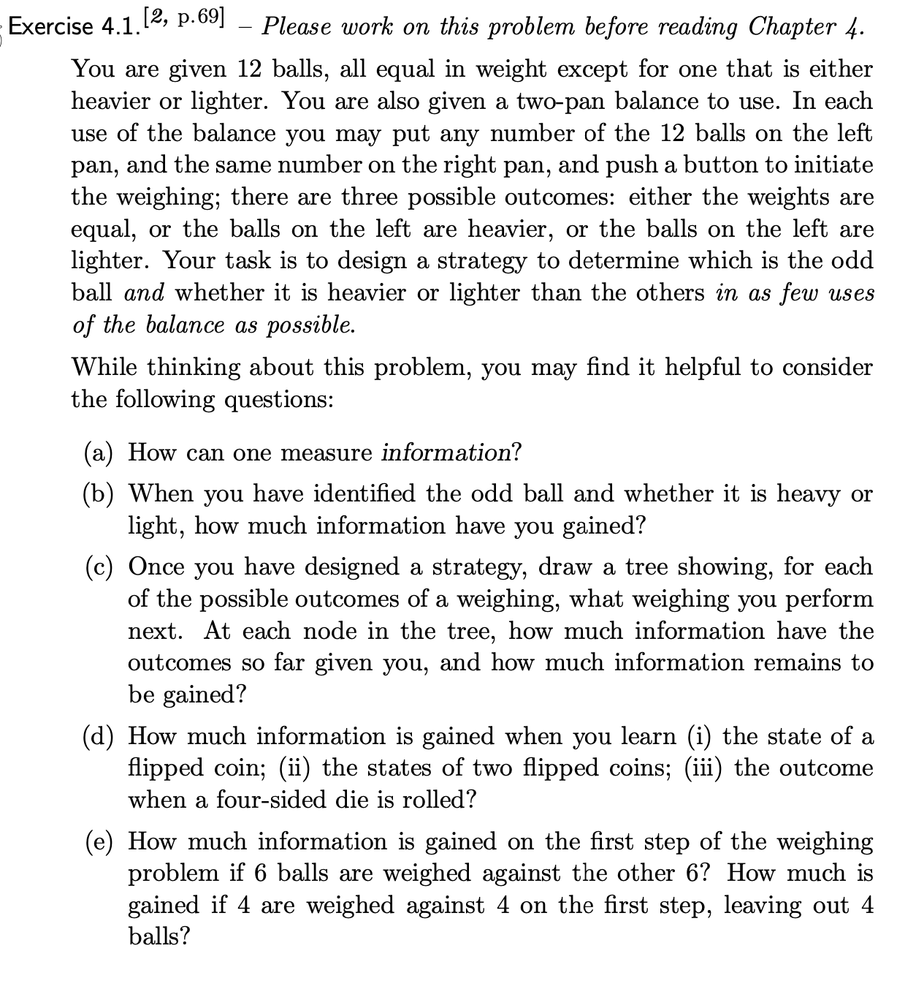

## Answers

#### A1

#### A2

#### 2.16

#### A3

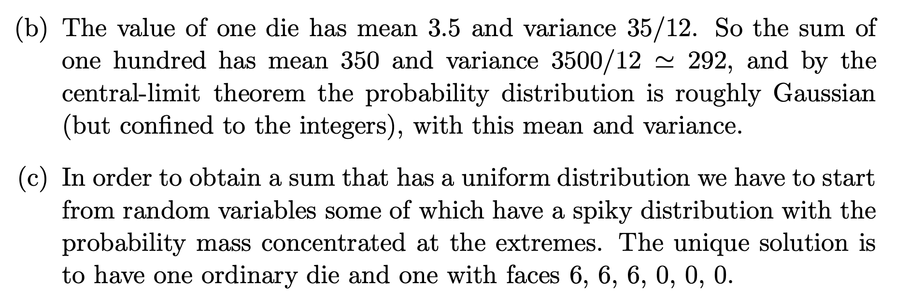

#### A4
frequencies; random

#### A5
generative

#### A6
generative model; *conditional* probability; unobserved variables; Bayes’ theorem

#### A7
assumptions are necessary no matter what. Bayesian priors are more transparent. There are assumptions with the likelihood as much as the prior, data collection etc etc etc.

#### 2.25

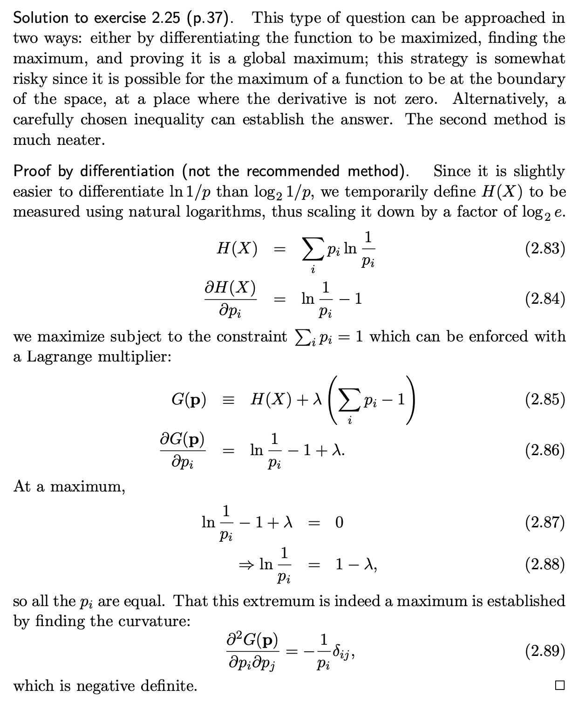
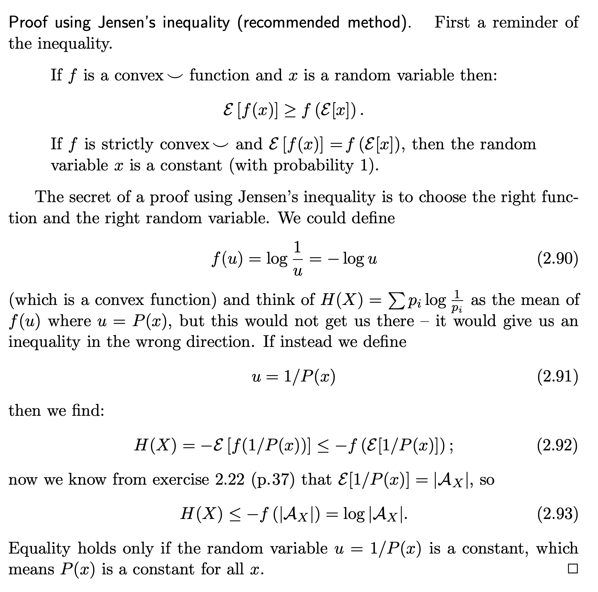

#### 3.8

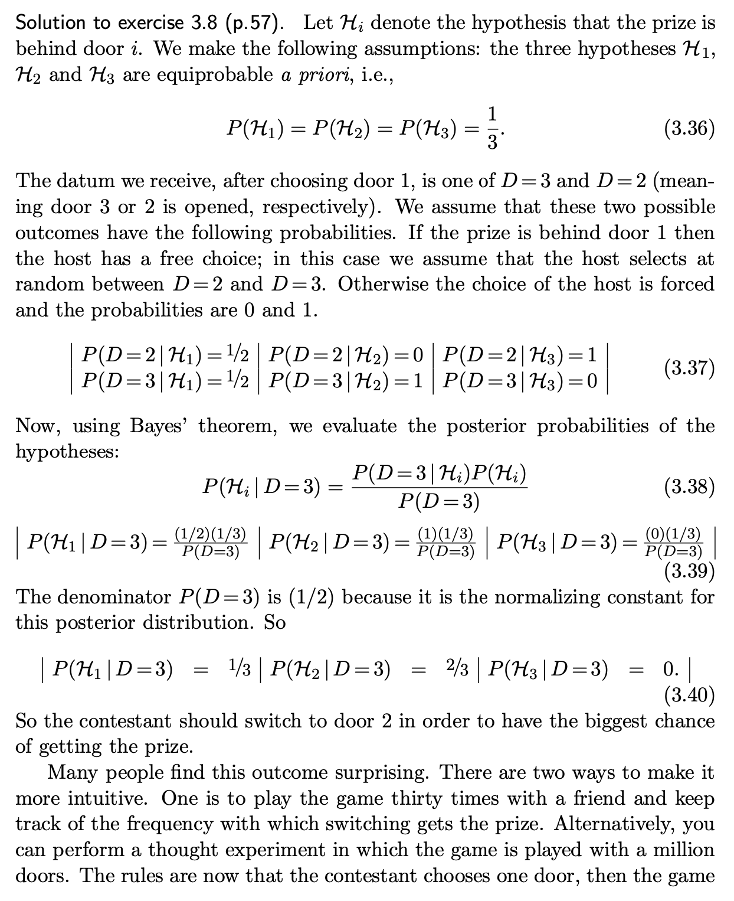
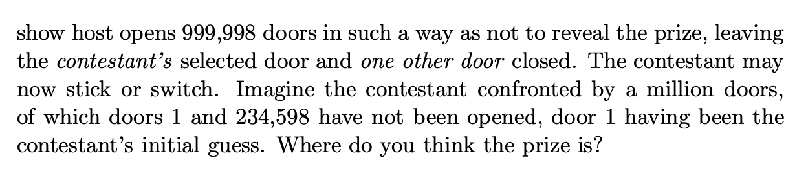

#### 3.9

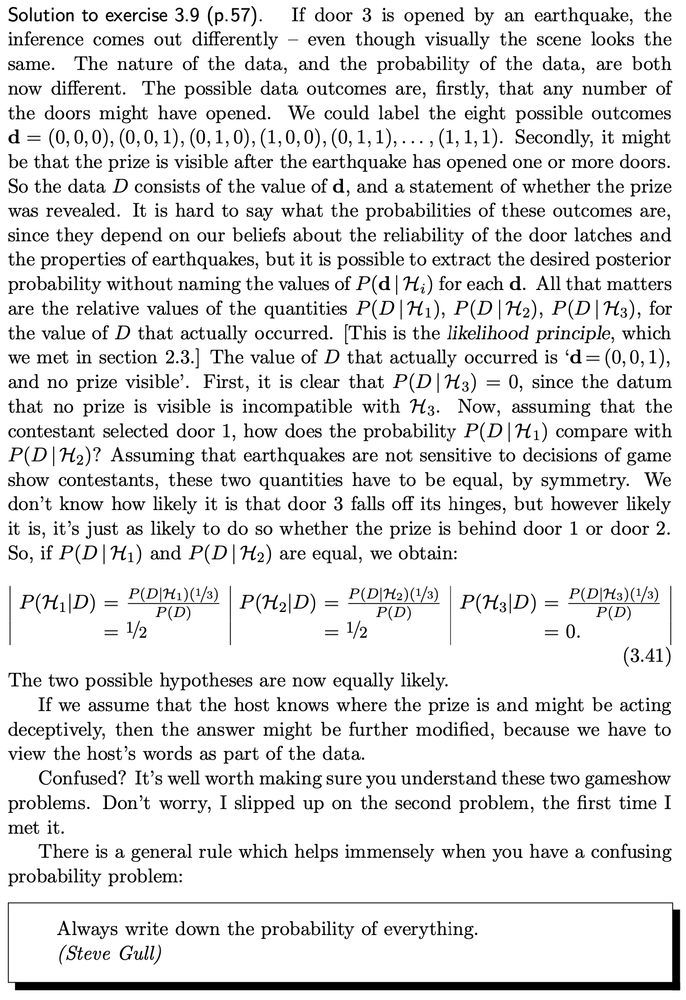

#### 4.1
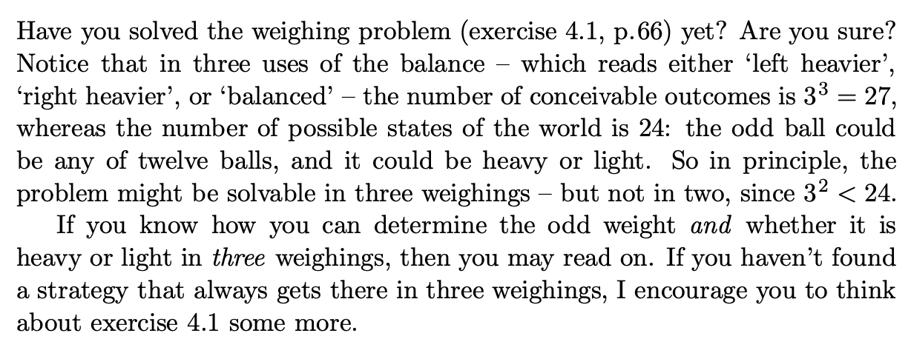
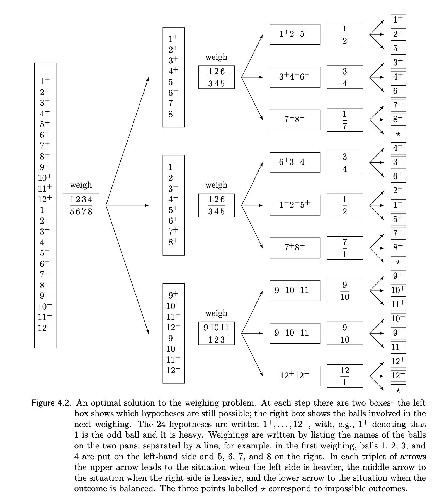
