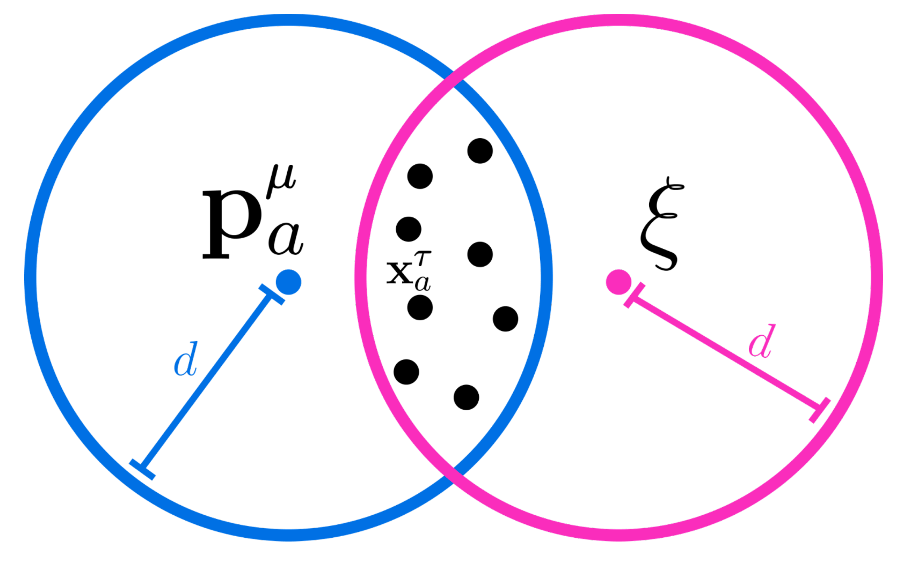
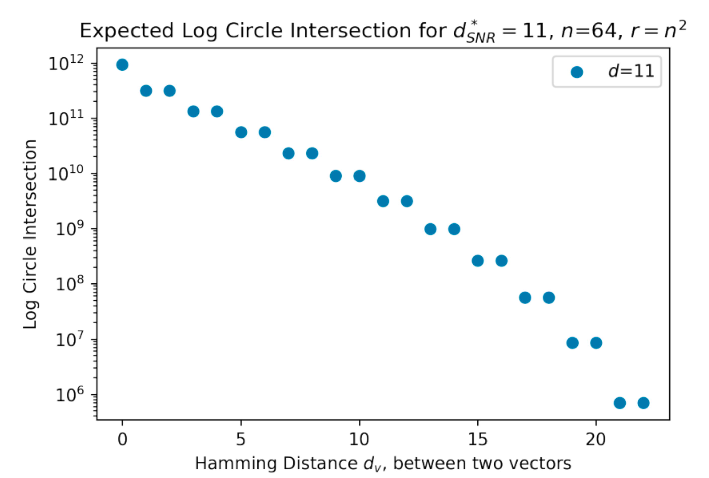
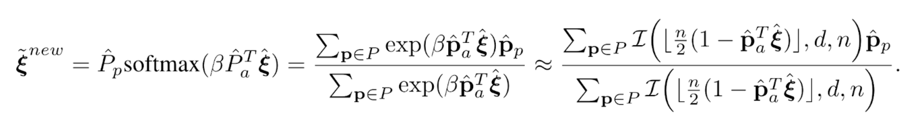
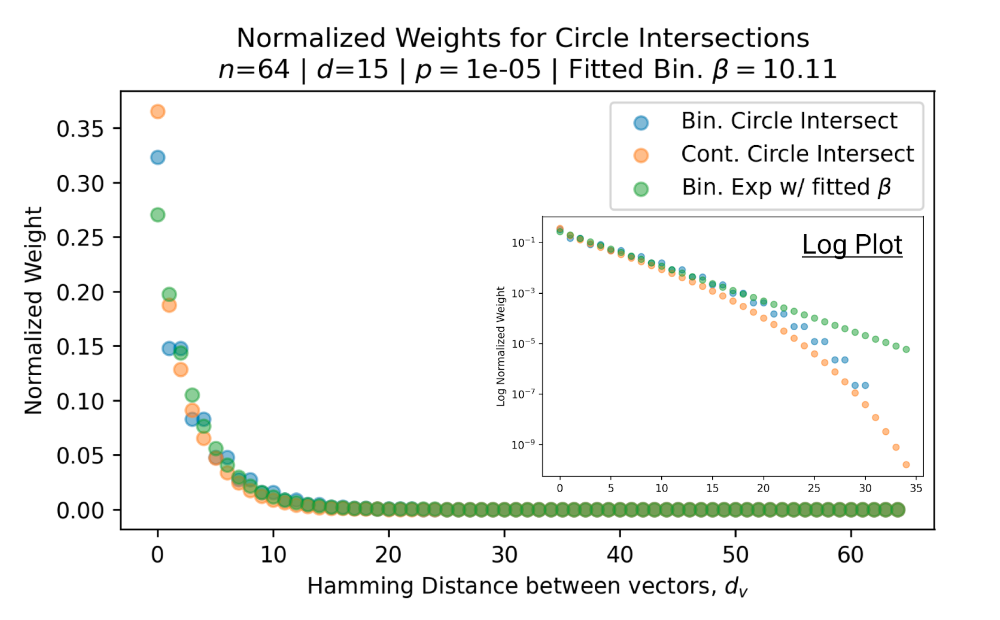
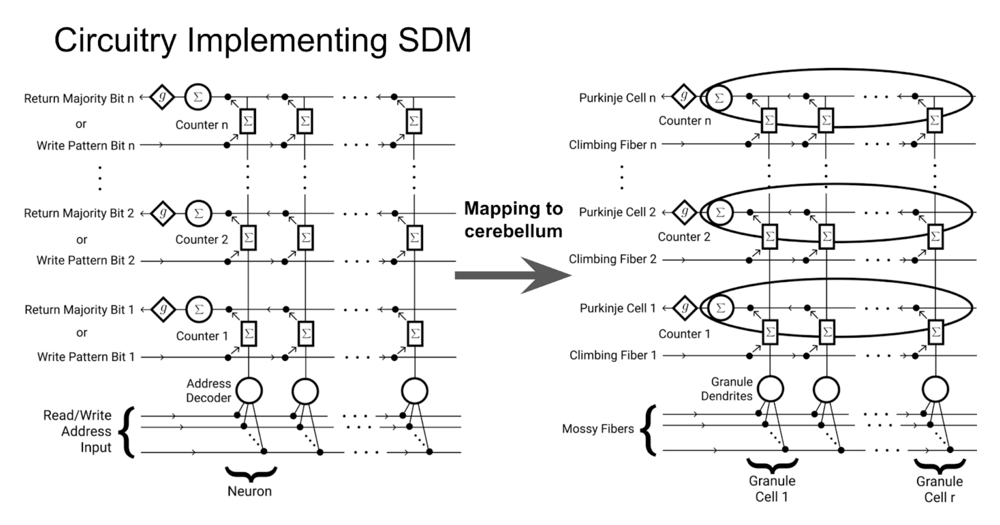

*We show the heuristic Attention operation can be implemented with simple properties of high dimensional vectors, in a biologically plausible fashion.*

  

While Transformers and Attention have dominated deep learning, there remains limited intuition for why they work so well. In this NeurIPS paper just out(!), [Cengiz Pehlevan](https://pehlevan.seas.harvard.edu/) and I show that Attention can be closely related under certain data conditions to Kanerva's Sparse Distributed Memory (SDM), a biologically plausible associative memory model developed in 1988.

Full paper [here](https://arxiv.org/abs/2111.05498). If you prefer videos I gave a talk at the MIT Center for Brains Minds+ Machines summarizing the work:  

  <iframe width="560" height="315" src="https://www.youtube.com/embed/THIIk7LR9_8" title="YouTube video player" frameborder="0" allow="accelerometer; autoplay; clipboard-write; encrypted-media; gyroscope; picture-in-picture" allowfullscreen></iframe>

SDM's read operation uses intersections between high dimensional hyperspheres that approximate the exponential over sum of exponentials that is Attention's softmax function.

  

As the hyperspheres are pulled further apart, the number of “neurons” in their intersection decays approximately exponentially, as shown by this linear scatter plot in log space.

  

All the mathematical notation is defined in the paper but the below equation gives the fundamental relationship, where I can replace my exponential in Attention (on the left) with the weighting each pattern receives from hypersphere intersections used by SDM (on the right).

  

For example, blue and orange dots here are two different versions of SDM and green is the Attention softmax. Look at their agreement which holds across many different SDM settings.

  

Attention can approximate SDM in theory but what about in practice? This is hard to answer definitively but we investigate pretrained GPT2 style Transformers and can give a weak yes! This pretrained GPT2 variant that learns its Beta coefficients is nicely bounded by different optimal versions of SDM and particularly close to the version that maximizes handling of query noise.

  

There is a lot more theoretical and experimental analyses of the SDM Attention relationship in the paper. We also develop a new continuous version of SDM, explain the LayerNorm and Feedforward layers of the Transformer Architecture and relate it to other external memory implementations. On the biology front we summarize work mapping SDM to the cerebellum, thus providing a potential biological implementation of Transformer Attention.

  

This work raises two big picture questions that we can’t yet answer but are motivated by our results:
1. Is the Transformer so successful because it is performing a key cognitive operation?
2. Given the Transformer’s empirical success, is SDM the correct theory for cerebellar function?

  

The full paper can be found [here](https://arxiv.org/abs/2111.05498).

This has been my first, first author paper and not only defined my first year of graduate school but also set the scene for the rest of my PhD. I am working on a number of follow up projects seeing to what extent SDM can explain fundamentals of cognition and deep learning. Outreach for potential collaborations is very welcome and my email is brickentrenton [at] gmail.com :).

*Thanks to Dr. Gabriel Kreiman, Alex Cuozzo, Miles Turpin, Dr. Pentti Kanerva, Joe Choo-Choy, Dr. Beren Millidge, Jacob Zavatone-Veth, Blake Bordelon, Nathan Rollins, Alan Amin, Max Farrens, David Rein, Sam Eure, Grace Bricken, and Davis Brown for providing invaluable inspiration, discussions and feedback. Special thanks to Miles Turpin for help working with the Transformer model experiments.*

*I would also like to thank the open source software contributors that helped make this research possible, including but not limited to: Numpy, Pandas, Scipy, Matplotlib, PyTorch, HuggingFace, and Anaconda.*
