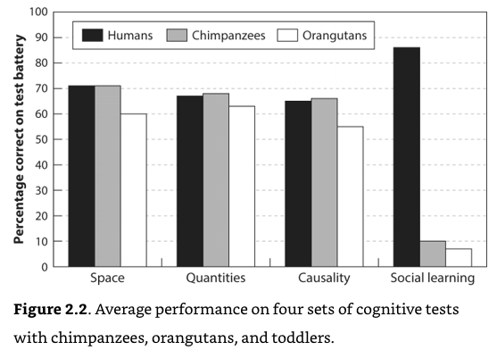
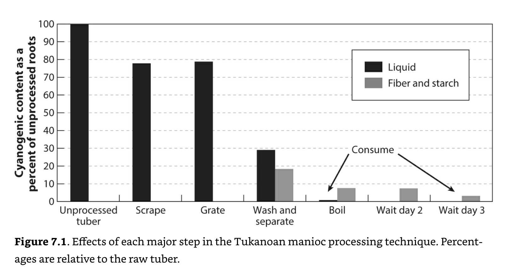

*Reflections on the relationship between copying and creativity across art, science, and evolutionary biology.*

I have often heard and long believed that copying is uncreative. The only reason to copy something is because you lack good enough ideas to create something novel yourself. However, in trying to grapple with self perceptions of creativity across science, photography, music and art, I now believe that in a few distinct ways copying is essential to creativity. An important implication of my argument is that the most creative people are often not those who dream up something de novo from a blank canvas but those who have the largest set of tools and building blocks that they can combine in novel ways.

Before going any further, I will define something creative as: novel and valuable. The music I have tried to produce is certainly novel, nothing quite like it has (thankfully) existed before… however, not even my mother would call it creative because it sounds so awful. Therefore, I assume creativity requires a baseline level of value or quality, in addition to being novel.

I [like photography](https://blitz-analog.github.io/) but have considered it the least creative of all artforms. Partly because if I can do it then surely it can't be creative(!), but more fundamentally because photography can only capture reality, not generate an alternative one from a blank canvas. Yes, our reality is highly diverse and can be shaped with props and lighting effects, but it remains constrained by the laws of physics, while one's imagination and creation of digital graphics or music is not constrained to the same degree.

However, in trying my hand at music and art, I have been struck by how many primitives there are that everyone seems to copy in making creative pieces. These primitives exist because, for whatever reason, they are aesthetically pleasing to humans. Copying these primitives is a reliable way to produce something that is both of high quality and still leaves plenty of degrees of freedom for novelty. The most striking primitive is probably the [four chords](https://www.youtube.com/watch?v=oOlDewpCfZQ&ab_channel=TheAxisofAwesome) used in many of the most popular pop songs throughout the decades:

In photography and painting there is the [Rule of Thirds](https://www.slrlounge.com/glossary/rule-of-thirds-definition/#:~:text=Description%3A%20In%20photography%2C%20the%20rule,one%20of%20the%20lines%20itself), in cooking the use of salt. Deviation from these primitives is possible and a potential avenue for novelty but can be dangerous in creating something that, while novel, is too different to be mapped onto the space of existing ideas and as a result not recognized as valuable, like the static random flickers of a TV that has lost signal. Therefore, too much copying makes something unoriginal, too little and it is unrecognizable. Whether or not there is in fact “nothing new under the sun”, combining primitives is a powerful, and at some level required, way to create something valuable. The way these primitives are combined may in itself also be the source of novelty, alternatively there are many modifications that can be made on top to create something that is novel yet still valuable and thus creative.

  
   
  <em> It’s novel! But is it creative? </em>  

One implication of my argument is that the most creative people are not those who start with a blank slate and travel naked through virgin lands, relying upon nothing that has been created before and using only their mind’s eye for navigation. Rather, the most creative are domain experts and curators of knowledge, this curation and appreciation of what has been done before creates a large set of primitives and tools with which to modify and combine in novel ways, creating products that fit the equation valuable + novel = creative.

Considering the realm of science, an embarrassing number of our most significant discoveries[^accidentialDiscovery] are not made in a vacuum but only when sufficient evidence is accessible to be combined in novel ways. A great example is the theory of evolution where enough global expeditions had occurred and presented enough samples of biological diversity that the facts for evolution were there, ready to be put together. While Darwin gets all of the credit, the theory of evolution was independently discovered just a few years later by [Alfred Russel Wallace](http://www.bbc.com/earth/story/20161104-the-other-person-that-discovered-evolution-besides-darwin?referer=https%3A%2F%2Fwww.google.com%2F&referer=https%3A%2F%2Fwww.google.com%2F&referer=https%3A%2F%2Fwww.google.com%2F&referer=https%3A%2F%2Fwww.google.com%2F&referer=https%3A%2F%2Fwww.google.com%2F&referer=https%3A%2F%2Fwww.google.com%2F&referer=https%3A%2F%2Fwww.google.com%2F&referer=https%3A%2F%2Fwww.google.com%2F) precisely because all of the primitives for this logical leap were in position. Similarly, while Watson and Crick discovered the double helix, they never actually did any of their own experiments or generated new, proprietary data to make their finding. All of the facts for its discovery were present and others, including Rosalind Franklin, Linus Pauling and Maurice Wilkins were working on the same problem and in some cases even had better, proprietary data of their own[^EighthDay]! I am not trying to diminish these feats of deduction and creative discovery that Darwin, Watson and Crick made, only pointing out that their creative genius depended upon the curation and combination of the right primitives rather than armchair thinking about a castle in the clouds. And it is worth pointing out that not only did they need to collect the right information but also know what information to ignore that led other researchers astray.

Moving beyond art and science it has struck me how crucial copying is to evolutionary biology.  [The Secret Of Our Success](https://slatestarcodex.com/2019/06/04/book-review-the-secret-of-our-success/) crafts a compelling narrative that what makes humans so smart, successful and unique is our incredible ability for copying. As the below graphic shows, compared to our monkey relatives we are not faster at thinking or better at memorizing, just much better at copying. We invent tools and make discoveries through brute force trial and error, but when we do stumble upon a discovery, we ensure that it is not forgotten and passed through the generations, over time leading to an accumulation of technology.

  
   
  <em> The only cognitive process we outperform our monkey siblings at is copying. Taken from The Secrets Of Our Success. </em>  

The Secret Of Our Success even notes that there would have been incentives throughout our evolution to copy more and socially domesticate ourselves. A wonderful example from the book is of cassava processing in the Amazon. Cassava is a staple crop that contains the poison cyanide in it. Through some amazing process of trial and error over likely centuries, the local tribes invented a multi-day, intricate and labour intensive procedure that gradually removes all the cyanide from the crop. There is no chance these ancient natives knew why they needed to perform each of these steps, just that bad things would happen if they did not. An entrepreneurial native frustrated with the process may propose skipping steps to shorten it. If they did, things at first would appear to be fine and even more efficient! How silly of everyone else to mindless follow such a bizarre antiquated processing technique! Yet, gradually the entrepreneur would succumb to insidious cyanide poisoning, gradually losing their vitality and dying a painful death as if they had been cursed by the Gods themselves. If this example is of interest, it is an example of “Chesterton’s Fence” that [I have written about at length](https://trentbrick.github.io/On-Chestertons-Fence/). A combination of scenarios like this and the benefits of retaining technological progress across generations has meant that we have evolved to copy social norms closely and without deviation. Next time you feel guilty about violating a social norm, this is most certainly why.

  
   
  <em> Cyanide concentration in cassava per processing step. Each one is clearly optimized to gradually remove all of the cyanide. Taken from The Secrets Of Our Success. </em>  

Beyond being the lifeblood for creativity, I believe copying is a wonderful way to learn. Feynman famously said “What I cannot create, I do not understand”, only by actually copying and going through the process can appreciate all of the nuance and details. It always amazes me how well I think I understand an idea after first reading it versus actually needing to implement it from scratch! There are many degrees of freedom and steps in the dance from a concept to its implementation, for better or worse.

  
   
  <em> Taken from Feynman’s office whiteboard upon his death. </em>  

I have heard the advice before that you should study enough to understand the outline of a field but not so much that you fail to create new ideas. According to the model I have put forward, newcomers may often be the most creative because they learn the primitives necessary to create something of value but don’t learn enough to become entrenched in the existing ways of combining them. This can lead to irreverent novel combinations producing creative results.

I’d love to get feedback on the ideas I have presented here! In the meantime happy creating :)

*Big thanks to Miles Turpin, Alina Gubanova, Ellie Ricker, and Luke Stewart for reviews of this piece and the conversations that led to it. All remaining errors and confusions are mine and mine alone.*

### Footnotes
* footnotes will be placed here. This line is necessary
{:footnotes}

[^accidentialDiscovery]: As examples of accidental discoveries in biology alone off the top of my head we have penicillin, the cowpox vaccine, and thermophilic polymerases (making PCR possible).

[^EighthDay]: The race to discover the double helix and much more is described in the book [The Eighth Day of Creation](https://www.amazon.com/Eighth-Day-Creation-Revolution-Commemorative/dp/0879694785).
