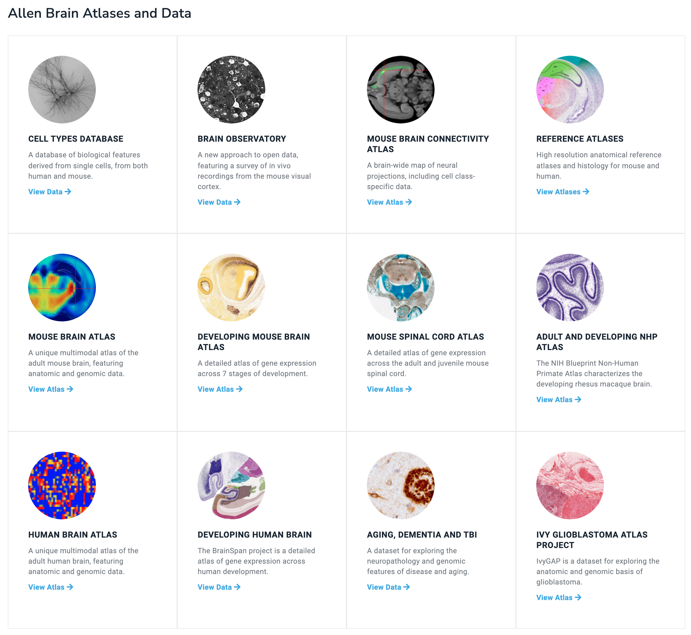
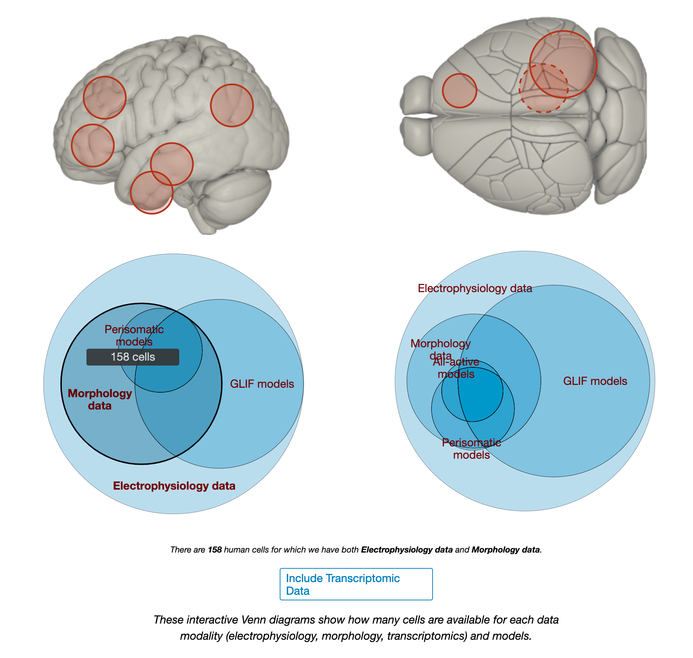
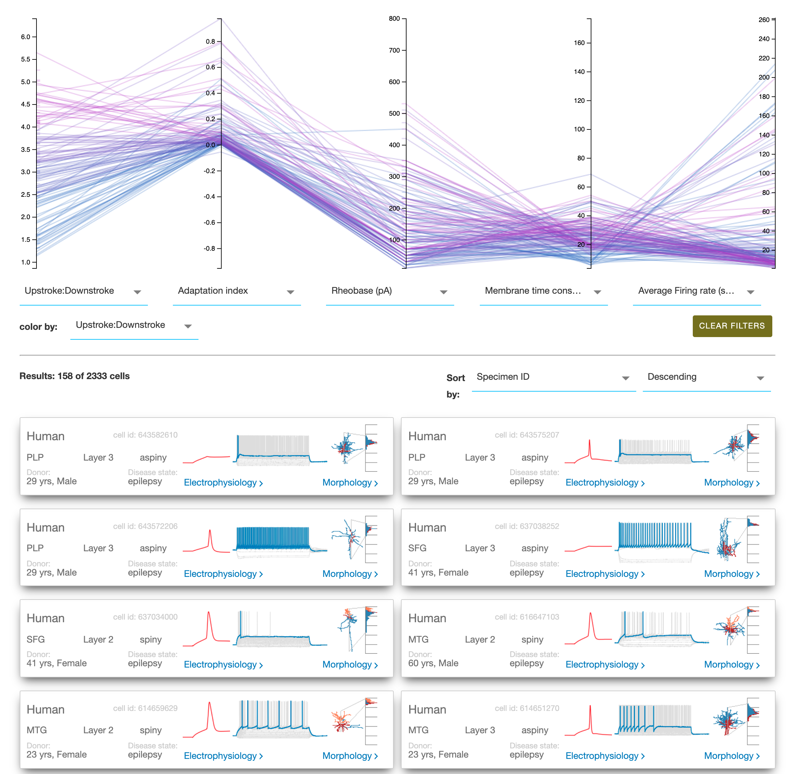
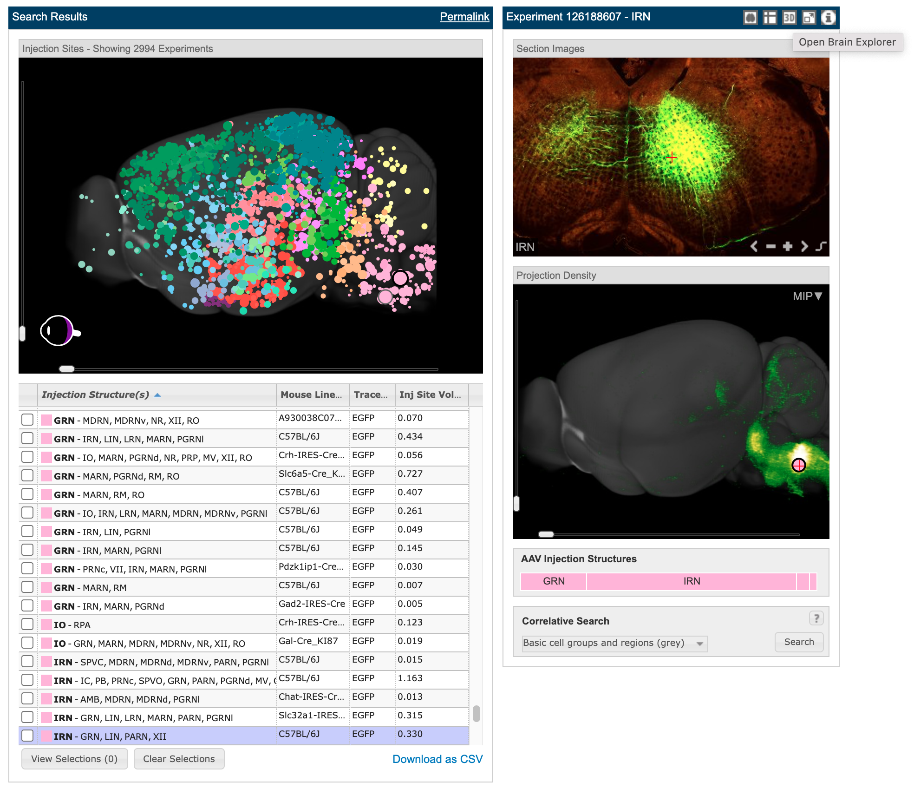
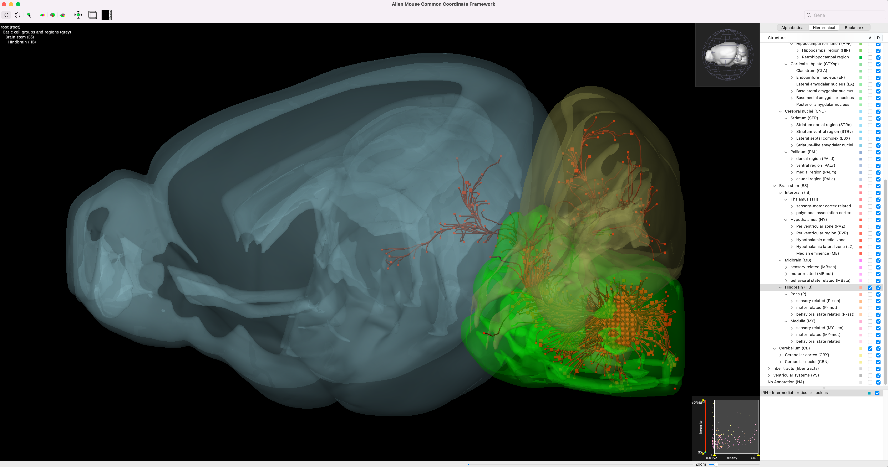
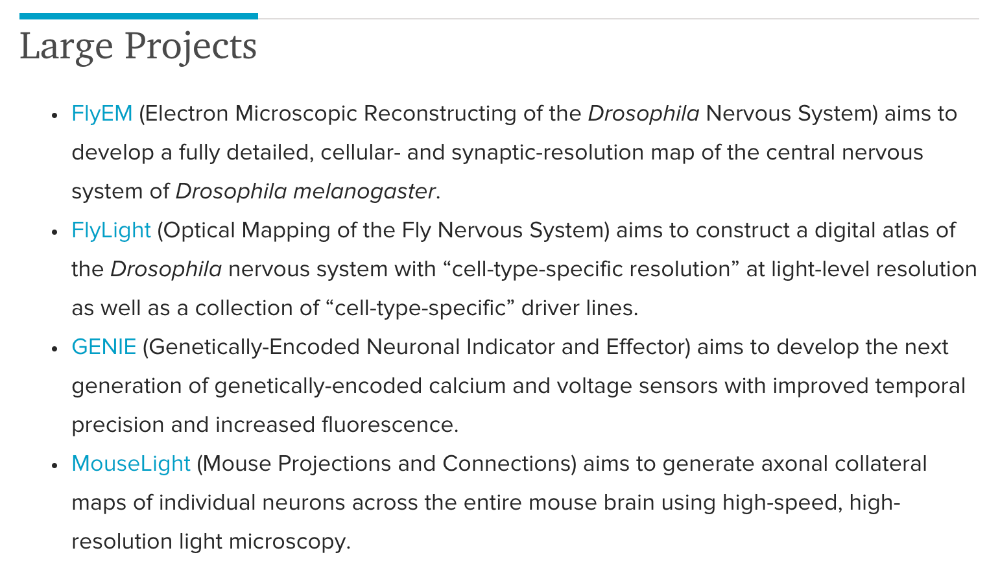
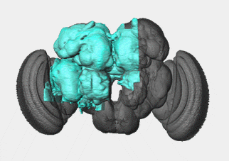
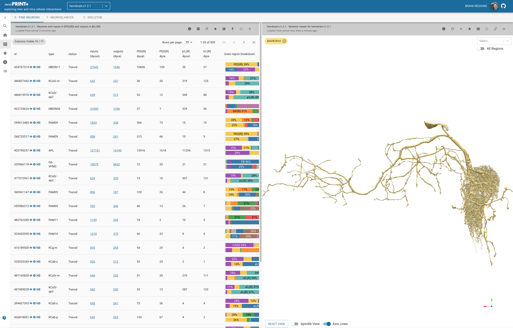
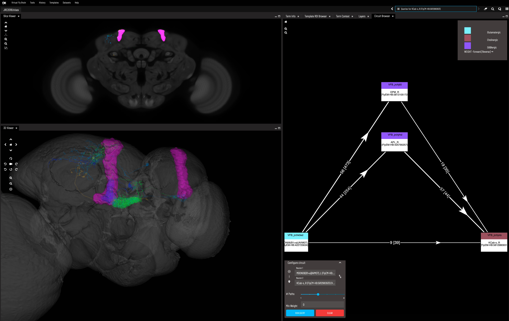
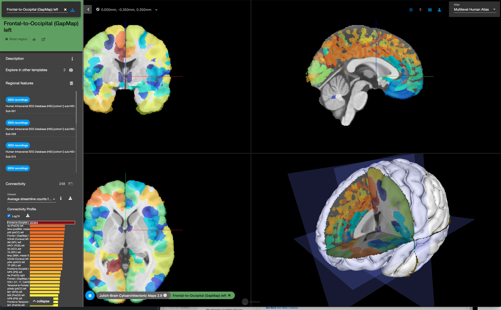

*Notes from exploring the current state of Brain Atlases*

---

  
   
  <em> Pyramidal Neurons in the Mouse visual cortex. | <a href="https://www.microns-explorer.org/phase1">Source</a></em>

The amount of data we are collecting from the brain is awe inspiring. I knew that we had a map of the 302 neurons in the [C. Elegans brain](https://wormatlas.org/MoW_built0.92/MoW.html), we almost have a full map of the [Drosophila](https://www.nytimes.com/2021/10/26/science/drosophila-fly-brain-connectome.html) (fruit fly) brain, and progress was being made on whole brain maps for [mice and humans](https://portal.brain-map.org/), but I had never tried to dive into the data and mess around with state of the art visualization tools. I've now spent a day doing so and will share some notes on what is out there.

Hopefully this is just generally cool and interesting, (I have tried to add some cool photos). Hopefully it is also useful for anyone doing neuroscience related research so that they better know what resources are out there. Especially because there are quite a lot of very similar tools being developed by different groups (why can't everyone just work together?! And my regards to the engineers who have had to independently develop each of these 3D neuron data viewers...)

  
   
  <em> Who knew Brain Atlases could be so fun? <a href="https://ngl.microns-explorer.org/#!%7B%22dimensions%22:%7B%22x%22:%5B4e-9%2C%22m%22%5D%2C%22y%22:%5B4e-9%2C%22m%22%5D%2C%22z%22:%5B4e-8%2C%22m%22%5D%7D%2C%22position%22:%5B328983.5%2C117353.5%2C19709.5%5D%2C%22crossSectionScale%22:8.166169912567627%2C%22projectionOrientation%22:%5B-0.5617428421974182%2C0.44370320439338684%2C-0.02653450332581997%2C0.6977595090866089%5D%2C%22projectionScale%22:23095.594292315585%2C%22projectionDepth%22:-9.918776942798441%2C%22layers%22:%5B%7B%22type%22:%22image%22%2C%22source%22:%7B%22url%22:%22precomputed://https://bossdb-open-data.s3.amazonaws.com/iarpa_microns/minnie/minnie65/em%22%2C%22subsources%22:%7B%22default%22:true%7D%2C%22enableDefaultSubsources%22:false%7D%2C%22tab%22:%22source%22%2C%22annotationColor%22:%22#7d7d7d%22%2C%22shaderControls%22:%7B%22normalized%22:%7B%22range%22:%5B86%2C172%5D%7D%7D%2C%22name%22:%22img%22%7D%2C%7B%22type%22:%22segmentation%22%2C%22source%22:%22precomputed://gs://iarpa_microns/minnie/minnie65/seg%22%2C%22tab%22:%22segments%22%2C%22annotationColor%22:%22#949494%22%2C%22selectedAlpha%22:0.3%2C%22segments%22:%5B%22864691135269913253%22%2C%22864691135920699395%22%5D%2C%22segmentQuery%22:%22864691135269913253%2C%20864691135590002187%2C%20864691136100014453%2C%20864691136105679065%22%2C%22colorSeed%22:1416464799%2C%22name%22:%22seg%22%7D%5D%2C%22showSlices%22:false%2C%22selectedLayer%22:%7B%22visible%22:true%2C%22layer%22:%22seg%22%7D%2C%22layout%22:%7B%22type%22:%22xy-3d%22%2C%22orthographicProjection%22:true%7D%7D">See it for yourself here</a> | <a href="https://www.microns-explorer.org/gallery-mm3 ">Source</a> </em>

**Summary of what follows:**
* For Drosophila use [Virtual Fly Brain](https://www.virtualflybrain.org/) and its [supporting analyses](https://neuprint.janelia.org/?dataset=hemibrain:v1.2.1&qt=findneurons).
* For humans and higher levels of abstraction in mice use [Allen Brain Map](https://portal.brain-map.org/).
* For mice neocortex in high detail use [MICrONs](https://www.microns-explorer.org/).
* If you don't care about your model organism and just want the best connectomics use the Drosophila Virtual Fly Brain. If you care about gene expression then use the Allen Brain Map.

---

**The Landscape:**

***[Allen Brain Map](https://portal.brain-map.org/)*** - Everything mice and humans.

Here is a summary of all their different datasets.

  
   
  <em> It's Atlases all the way down... | <a href="https://portal.brain-map.org/">Source</a></em>

A big strength of the Allen datasets is their gene expression maps across the whole brain (and spinal cord and across development).

I am particularly impressed by their cell types database not only cataloguing the morphology but also doing patch recordings.
Their gene expression data is overwhelming in its detail. The high resolution microscopy images should be more people's screen savers.

  
   
  <em> The human cells were recorded from donors within 30 hours post death and their cause of death and brain needed to satisfy a number of criteria (outlined on the website) | <a href="https://celltypes.brain-map.org/">Source</a></em>

  
   
  <em> I thought this degree of detail and data was very impressive | <a href="https://celltypes.brain-map.org/data?donor__species=Homo%20Sapiens&nr__reconstruction_type=%5Bfull,dendrite-only%5D">Source</a></em>

[Here](https://www.youtube.com/watch?v=PBRmR4hNoRM&ab_channel=AllenInstitute) is the best walkthrough of the functionally of their viewer that I came across.

Their axon tracing is cool but not particularly spatially precise picking up many neurons in the same general area. This is fine for broad statements about regions connecting to one another but nothing more specific. (The best connectivity tools I found were by Janelia with their Drosophila hemisphere dataset, see below)

  
   
  <em> 2994 different tracer experiments with blobs in the top left panel showing each of their injection sites. Clicking on any of them brings up the other panels. Clicking the button in the top right where my cursor is hovering will open up their brain explorer software to do additional visualizations. The button just to the right of it is for high res imagery of the scan that is so beautiful (see next image). | <a href="https://connectivity.brain-map.org/">Source</a></em>

 

  
   
  <em> High res microscopy showing in more detail the tracing experiment done in the above image. There are 140 brain slices from this particular experiment you can explore though the panel bottom center. | <a href="https://connectivity.brain-map.org/projection/experiment/siv/126188607?imageId=126189090&imageType=TWO_PHOTON,SEGMENTATION&initImage=TWO_PHOTON&x=17883&y=17260&z=3">Source</a></em>

 

  
   
  <em> Brain explorer showing the tracer fluoresence with different brain regions overlayed in 3D. Gene expression experiments can also be visualized in this way. | <a href="https://connectivity.brain-map.org/projection/experiment/siv/126188607?imageId=126189090&imageType=TWO_PHOTON,SEGMENTATION&initImage=TWO_PHOTON&x=17883&y=17260&z=3">Source</a></em>

They also have some interesting coding and firing datasets including [here](https://observatory.brain-map.org/visualcoding) and [here](https://portal.brain-map.org/explore/connectivity/synaptic-physiology), the latter of which seems to be quite exploratory.

You can download their brain explorer software [here](https://human.brain-map.org/static/brainexplorer) and use the web interface to find things that are then displayed inside the software locally. I didn't find it as useful as some of the other viewers that will be covered below it is still pretty good.

---

***[MICrONs](https://www.microns-explorer.org/)*** - 1mm cubed of mouse V1 primary visual cortex with every neuron and synapse traced.

> A functional connectome containing 200,000 cells, 75,000 neurons with physiology, and 523 million synapses.

  
   
  <em> Overwhelmed yet? | <a href="https://www.microns-explorer.org/cortical-mm3">Source</a></em>

Funded by IARPA, this is a collaboration between the Allen Brain Institute (see previous section), the [Seung](https://seunglab.org/) lab at Princeton,and [Tolias](https://toliaslab.org/) lab at Baylor College of Medicine to create automated large scale connectivity maps.

Uses Neuroglancer for visualization. Developed by Google and open sourced, for its purpose I think this is one of the best softwares (Janelia also has an integration with it).

They have combined calcium recording with EM microscopy to have very high accuracy image segmentation. This has included training convolutional networks to perform automated segmentation that has then been proofread by hand.

Take a look at their [Gallery](https://www.microns-explorer.org/gallery-mm3) where they highlight many of the cell types you can then look at in Neuroglancer.

  
   
  <em> An example of the Neuroglancer platform | <a href="https://www.microns-explorer.org/cortical-mm3">Source</a></em>

Here is an alright tutorial to [Neuroglancer](https://www.youtube.com/watch?v=YTbu6vMljuE&ab_channel=ForrestCollman). If you want to see more neurons double click them on the EM image on the left.  

If you want to know how hard it is to do neuron segmentation you can try this surprisingly fun game made by the Seung lab: [EyeWire](https://eyewire.org/).

Now imagine doing this but by hand with coloured pens in the 1960s... This is what Brenner and his team did to work out the c. elegans connectome.

  
   
  <em> What is most striking to me about this dataset is just how densely packed neurons and their vasculature are. It is incredibly hard to parse this tangled mess. All I did here was double click blobs on the EM scan image in the left panel to get neurons nearby to one already being displayed. Before long I had 4 neurons all packed together in the middle of a huge vasculature web! <a href="https://ngl.microns-explorer.org/#!%7B%22dimensions%22:%7B%22x%22:%5B4e-9%2C%22m%22%5D%2C%22y%22:%5B4e-9%2C%22m%22%5D%2C%22z%22:%5B4e-8%2C%22m%22%5D%7D%2C%22position%22:%5B175309.890625%2C134519.890625%2C21162.5%5D%2C%22crossSectionScale%22:7.096617776349856%2C%22projectionOrientation%22:%5B-0.021553166210651398%2C0.23470096290111542%2C-0.05687883868813515%2C-0.9701627492904663%5D%2C%22projectionScale%22:56209.51267392369%2C%22projectionDepth%22:-19.84273261064918%2C%22layers%22:%5B%7B%22type%22:%22image%22%2C%22source%22:%7B%22url%22:%22precomputed://https://bossdb-open-data.s3.amazonaws.com/iarpa_microns/minnie/minnie65/em%22%2C%22subsources%22:%7B%22default%22:true%7D%2C%22enableDefaultSubsources%22:false%7D%2C%22tab%22:%22source%22%2C%22shaderControls%22:%7B%22normalized%22:%7B%22range%22:%5B86%2C172%5D%7D%7D%2C%22name%22:%22img65%22%7D%2C%7B%22type%22:%22image%22%2C%22source%22:%7B%22url%22:%22precomputed://https://bossdb-open-data.s3.amazonaws.com/iarpa_microns/minnie/minnie35/em%22%2C%22subsources%22:%7B%22default%22:true%7D%2C%22enableDefaultSubsources%22:false%7D%2C%22tab%22:%22source%22%2C%22shaderControls%22:%7B%22normalized%22:%7B%22range%22:%5B112%2C172%5D%7D%7D%2C%22name%22:%22img35%22%2C%22visible%22:false%7D%2C%7B%22type%22:%22segmentation%22%2C%22source%22:%22precomputed://gs://iarpa_microns/minnie/minnie65/seg%22%2C%22tab%22:%22segments%22%2C%22annotationColor%22:%22#8f8f8a%22%2C%22selectedAlpha%22:0.41%2C%22notSelectedAlpha%22:0.06%2C%22segments%22:%5B%22864691134064155671%22%2C%22864691135269913253%22%2C%22864691135293126156%22%2C%22864691135387899829%22%2C%22864691135471224712%22%2C%22864691135474596928%22%2C%22864691135657783170%22%2C%22864691135937286404%22%2C%22864691136443719299%22%2C%22864691136534887842%22%2C%22864691136812081779%22%5D%2C%22segmentQuery%22:%22864691135269913253%2C%20864691135293126156%2C%20864691135303399847%2C%20864691135307240262%2C%20864691135358985048%2C%20864691135367308281%2C%20864691135386593409%2C%20864691135428608048%2C%20864691135446864980%2C%20864691135463706181%2C%20864691135544579880%2C%20864691135560721377%2C%20864691135590150923%2C%20864691135644850415%2C%20864691135697462549%2C%20864691135700443515%2C%20864691135748826153%2C%20864691135754758610%2C%20864691135785592772%2C%20864691135937286404%2C%20864691135946888545%2C%20864691136812081779%2C%20864691136951664863%2C%20864691136952074207%22%2C%22colorSeed%22:1689220695%2C%22name%22:%22seg65%22%7D%2C%7B%22type%22:%22segmentation%22%2C%22source%22:%22precomputed://gs://iarpa_microns/minnie/minnie35/seg%22%2C%22tab%22:%22segments%22%2C%22annotationColor%22:%22#8a8a8a%22%2C%22segments%22:%5B%22864691137827278437%22%2C%22864691138020403235%22%2C%22864691138081021535%22%2C%22864691138134948293%22%2C%22864691138142870469%22%2C%22864691138153699060%22%2C%22864691138178964470%22%2C%22864691138345166401%22%5D%2C%22name%22:%22seg35%22%7D%5D%2C%22showSlices%22:false%2C%22selectedLayer%22:%7B%22visible%22:true%2C%22layer%22:%22seg65%22%7D%2C%22layout%22:%7B%22type%22:%22xy-3d%22%2C%22orthographicProjection%22:true%7D%7D">Source (Warning this may take a long time to load)</a></em>

---

***[Janelia](https://www.janelia.org/)*** - Drosophila everything.

Here are their main projects:

  
   
  <em> Janelia Main Projects | <a href="https://www.janelia.org/our-research/overview/project-teams">Source</a></em>

As far as I know, FlyEM is their most ambitious project by far. To date they have a full map of the entire drosophila hemibrain which is everything below:

  
   
  <em> Drosophila Hemibrain. Given that the brain is symmetric down the middle, this looks like about 80% of the unique circuitry. They say "This connectome reconstruction contains around 25,000 neurons, which can be grouped into thousands of distinct cell types spanning several brain regions." Checkout the source for this image as there are lots of great videos/overviews. <a href="https://www.janelia.org/project-team/flyem/hemibrain">Source</a></em>

 

There are a number of different projects and viewers that exist and it can be confusing at first to know which one to use. Here are the main three:
* [neuPrint+](https://neuprint.janelia.org/results?dataset=hemibrain%3Av1.2.1&qt=findneurons&qr%5B0%5D%5Bcode%5D=fn&qr%5B0%5D%5Bds%5D=hemibrain%3Av1.2.1&qr%5B0%5D%5Bpm%5D%5Bdataset%5D=hemibrain%3Av1.2.1&qr%5B0%5D%5Bpm%5D%5Binput_ROIs%5D%5B0%5D=PED%28R%29&qr%5B0%5D%5Bpm%5D%5Boutput_ROIs%5D%5B0%5D=b%27L%28R%29&qr%5B0%5D%5BvisProps%5D%5BrowsPerPage%5D=25&qr%5B1%5D%5Bcode%5D=ng&qr%5B1%5D%5Bds%5D=hemibrain%3Av1.2.1&qr%5B1%5D%5Bpm%5D%5Bdataset%5D=hemibrain%3Av1.2.1&qr%5B1%5D%5Bpm%5D%5Bskip%5D=true&qr%5B1%5D%5Bpm%5D%5BbodyIds%5D=424767514&qr%5B2%5D%5Bcode%5D=sk&qr%5B2%5D%5Bds%5D=hemibrain%3Av1.2.1&qr%5B2%5D%5Bpm%5D%5Bdataset%5D=hemibrain%3Av1.2.1&qr%5B2%5D%5Bpm%5D%5Bskip%5D=true&qr%5B2%5D%5Bpm%5D%5BbodyIds%5D=424767514&tab=0&ftab=2) - Used for an overview of neural connectivity between different brain regions. Click on the "Brain Regions" label in the very top right of the screen to get a cheatsheet for what each of the short hand labels for each region mean. I have preloaded an example in the link. [Here](https://neuprint.janelia.org/help/videos) are a whole bunch of tutorials.

  
   
  <em> Showing an MBON (Mushroom Body Output Neuron). In the top left of the image where there is "0-Find Neurons | 1-Neuroglancer" etc. if you click neuroglancer than it will load it in! For any cell displayed if you click the small icons next to its name (in the left most column) you can view it in the browswer panel on the right, get a nice summary of its afferent and efferent connections, or open it in NeuroBridge (see below). <a href="https://neuprint.janelia.org/results?dataset=hemibrain%3Av1.2.1&qt=findneurons&qr%5B0%5D%5Bcode%5D=fn&qr%5B0%5D%5Bds%5D=hemibrain%3Av1.2.1&qr%5B0%5D%5Bpm%5D%5Bdataset%5D=hemibrain%3Av1.2.1&qr%5B0%5D%5Bpm%5D%5Binput_ROIs%5D%5B0%5D=PED%28R%29&qr%5B0%5D%5Bpm%5D%5Boutput_ROIs%5D%5B0%5D=b%27L%28R%29&qr%5B0%5D%5BvisProps%5D%5BrowsPerPage%5D=25&qr%5B1%5D%5Bcode%5D=ng&qr%5B1%5D%5Bds%5D=hemibrain%3Av1.2.1&qr%5B1%5D%5Bpm%5D%5Bdataset%5D=hemibrain%3Av1.2.1&qr%5B1%5D%5Bpm%5D%5Bskip%5D=true&qr%5B1%5D%5Bpm%5D%5BbodyIds%5D=424767514&qr%5B2%5D%5Bcode%5D=sk&qr%5B2%5D%5Bds%5D=hemibrain%3Av1.2.1&qr%5B2%5D%5Bpm%5D%5Bdataset%5D=hemibrain%3Av1.2.1&qr%5B2%5D%5Bpm%5D%5Bskip%5D=true&qr%5B2%5D%5Bpm%5D%5BbodyIds%5D=424767514&tab=0&ftab=2">Source</a></em>

* [Virtual Fly Brain](https://v2.virtualflybrain.org) - this is by far the coolest 3D visualizer in my humble opinion. It has so many smart tools beyond just being a viewer!

These tools include: a summary of information about the neuron; relevant academic references; options to see all the neurons that it connects to (afferent or efferent); overlays of the brain region it is part of; a circuit diagram of all the strongest connections between any two neurons within a given maximum path length. I wish it also had the summary statistics for connectivity that are provided by NeuPrint but it provides a link to all this NeuPrint info.

  
   
  <em> In the left two panels there is an EM scan (top) and 3D segmentation (bottom) I have displayed for a Kenyon cell and Mushroom body output neuron along with alpha lobes of the mushroom body. In the right panel we use the connectivity tool which displays the strongest two paths connecting these two neurons. These are both inhibitory interneurons, which we know from the fact they use GABA, shown by the legend in top right corner that uses the color purple (I know this is hard to see just from the screenshot). <a href="https://v2.virtualflybrain.org/org.geppetto.frontend/geppetto?id=VFB_jrchjvto&i=VFB_00101567,VFB_jrchk0ed,VFB_00102119,VFB_jrchk0ee,VFB_jrchk37x">Source</a></em>

* [NeuroBridge](https://neuronbridge.janelia.org/) - a way to move between the EM segmentation data and the light microscopy images for any given neuron. This is meant to work much better than doing a neuron geometry based BLAST search (original developed for nucleotide sequence similarity searches). Unless you are doing this I didn't find it especially useful.

---

***Other Atlases:***
* [EBRAINS](https://ebrains.eu/) - Funded by the European Union [Human Brain Project](https://www.humanbrainproject.eu/en/). I didn't look super closely but my impression is that the Allen datasets and software is superior. They seem to have human and rodent datasets and some gene expression (but this is actually provided by the Allen Institute!)

  
   
  <em> Maybe it's alright for getting a textbook level understanding of different brain regions and their summaries of their connectivity to other regions? But I would start with the Allen resources.<a href="https://atlases.ebrains.eu/viewer/#/a:juelich:iav:atlas:v1.0.0:1/t:minds:core:referencespace:v1.0.0:dafcffc5-4826-4bf1-8ff6-46b8a31ff8e2/p:minds:core:parcellationatlas:v1.0.0:94c1125b-b87e-45e4-901c-00daee7f2579-290/@:0.0.0.-W000.._eCwg.2-FUe3._-s_W.2_evlu..7LIx..0.0.0..1LSm">Source</a></em>

* [BrainMaps](http://brainmaps.org/) - the website seems to be old and somewhat outdated, they do have cool various stains of human brains.

* [Mosquito Brains](https://www.mosquitobrainbrowser.org/) - just when you thought there weren't enough datasets!

I am sure there are other atlases I am missing. If there are important ones not here then leave a comment or email me and I'll add them.

---

*"Ok just like you I am also now in awe and feel overwhelmed by this ever growing mountain of data" - you say - "now what?"* As incredible as these datasets are, we need to develop [better theories](https://gershmanlab.com/pubs/innocent_eye.pdf) for how the brain works to be able to put these datasets to work. I think that SDM is particularly compelling one and am working to validate/invalidate it with the help of datasets like these.

Some members of my lab and yours truly will also be making [3D connectomics diagrams](https://twitter.com/TrentonBricken/status/1481360881665470465) of brain regions of interest that capture statistical regularities in the neuron connectivities. Less detail than the actual neurons traced out in many of the above datasets, but with more detail than the 2D blobs for each brain region that you see in neuroscience textbooks. I'll add a link to this work and share more about it when it is further along.

---

*Thanks to [Milan Cvitkovic](https://twitter.com/MWCvitkovic) and [Max Farrens](https://twitter.com/lord_applebee) for reading drafts of this piece. All remaining errors are mine and mine alone.*
