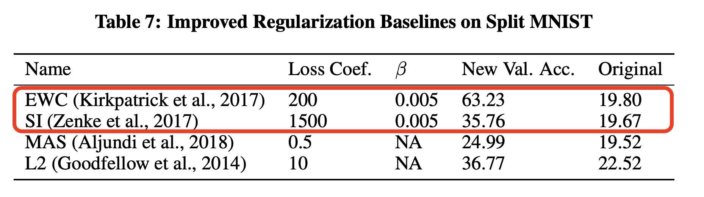

*A simple modification to improve Elastic Weight Consolidation and Synaptic Intelligence continual learning baselines.*

---

A number of influential continual learning algorithms like [Elastic Weight Consolidation](https://arxiv.org/abs/1612.00796) (EWC) and [Synaptic Intelligence](https://arxiv.org/abs/1703.04200?context=cs) (SI) protect neural network weights important for previous tasks from being updated by newer tasks. Otherwise, these network weights are overwritten by the next task, resulting in catastrophic forgetting.

It turns out that existing implementations of these algorithms have, at least for some tasks, been significantly **underestimating** their performance. This is because they need a small modification to be able to actually learn which network weights need protecting. In a Split MNIST class incremental benchmark, this modification leads to 43% higher validation accuracy.

These weight regularization methods use the magnitude of gradients during the backwards pass to infer what weights are important for a particular task. They then use a regularization term in the loss function to penalize the model from updating these weights during new tasks. However, in cases where the model performs very well on all training data within a task, there is almost no gradient for the model to be able to learn what weights are important!

In order to restore gradient information, we introduce a $$\beta$$ coefficient into the cross-entropy loss function when learning weight importances. This is used to make the model less confident in its predictions. A hyperparameter sweep found that $$\beta = 0.005$$ worked the best for both EWC and SI, leading to 43% and 15% performance gains as shown in the below figure.



This result is presented in the paper [Sparse Distributed Memory is a Continual Learner](https://openreview.net/forum?id=JknGeelZJpHP), which relies upon a version of MNIST where the images use pixel values [0,255] that are not rescaled to [0, 1] or normalized to have a mean of 0. We believe this makes the MNIST classes more orthogonal and easier for continual learning.[^IntegerMNIST] However, even when the pixels are rescaled, there is still see a performance boost (going from 27% when $$\beta=1.0$$ to 54% $$\beta=0.005$$) and also performance gains for Split CIFAR10.

The $$\beta$$ coefficient will not increase performance independently of other parameters. In both of the above cases, we also use gradient clipping, SGD with momentum and a single hidden layer of neurons. However, having these other modifications in place, $$\beta$$ remains worth experimenting with to potentially get significant performance gains. Our results are better than those of any other paper we have seen that uses the EWC or SI as baselines including [Re-evaluating Continual Learning Scenarios: A Categorization and Case for **Strong** Baselines](https://arxiv.org/abs/1810.12488) (emphasis mine).

---

## Replication

There are two ways to reproduce our results: 1. Clone [this](https://github.com/TrentBrick/Continual-Learning-Benchmark) GitHub repo which is a forked version of the original continual learning baseline and run the following command (after installing the requirements):

```bash
python -u iBatchLearn.py --gpuid 0 \
 --repeat 1 --incremental_class --optimizer SGD  \
 --momentum 0.9 --weight_decay 0.0 --force_out_dim 10 \
 --no_class_remap --first_split_size 2 --other_split_size 2 \
 --schedule 4 --batch_size 512 --model_name MLP1000 \
 --agent_type customization  --agent_name EWC_mnist  \
 --lr 0.03 --reg_coef 20000 --use_beta_coef True \
 --beta_coef 0.005
```

This uses the version of Split MNIST with [0,1] pixel values.

(if you are running on CPU set `--gpuid -1`).

2. Clone [this](https://github.com/anon8371/AnonPaper1) repo and in `test_runner.py` set:

```python
model_style = ModelStyles.CLASSIC_FFN
```

and

```python
cl_baseline = "EWC-MEMORY",
```

Then call: `python test_runner.py`!

This uses the version of Split MNIST with [0,255] pixel values.

## Citation

If you found this post useful for your research please cite the paper: [Sparse Distributed Memory is a Continual Learner](https://openreview.net/forum?id=JknGeelZJpHP).
```
@misc{SDMContinualLearning,
  title={Sparse Distributed Memory is a Continual Learner},
  url={https://openreview.net/forum?id=JknGeelZJpHP},
  journal={ICLR Submission},
  author={Anonymous},
  year={2022}, month={September}}
```

### Footnotes
* footnotes will be placed here. This line is necessary
{:footnotes}

[^IntegerMNIST]: This may explain why careful tuning of our regularization coefficient for the algorithms [Memory Aware Synapses](https://arxiv.org/abs/1711.09601) and [L2 Regularization](https://arxiv.org/abs/1312.6211) also led to slightly higher performance than reported in the [baselines paper](https://arxiv.org/abs/1810.12488).

---

*Thanks to the NSF Foundation and the Kreiman Lab for making this research possible. All remaining errors are mine and mine alone.*
