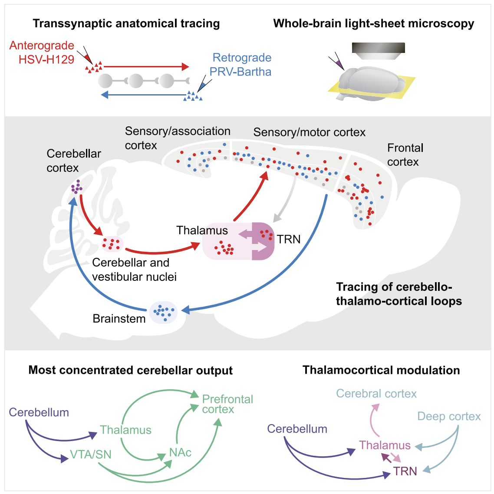
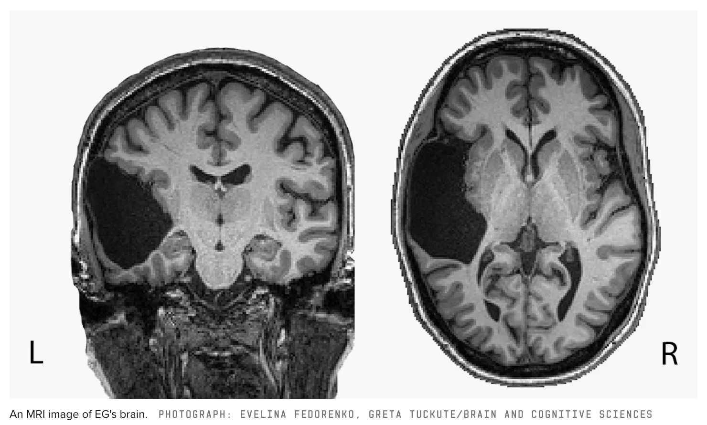

*Searching beyond the streetlight finds a plethora of important cerebellar functions.*

---

> A policeman sees a drunk man searching for something under a streetlight and asks what the drunk has lost. He says he lost his keys and they both look under the streetlight together. After a few minutes the policeman asks if he is sure he lost them here, and the drunk replies, no, and that he lost them in the park. The policeman asks why he is searching here, and the drunk replies, "this is where the light is". -- [Source](https://en.wikipedia.org/wiki/Streetlight_effect)

**Beyond the Streetlight** -- I believe this same phenomenon has occurred for our understanding of the cerebellum. Deficits in fine motor function are very easy to spot and were the simplest function to attribute to cerebellar lesions. This is still what is taught in most textbooks. However, it is less well known that the cerebellum contains [~70%](https://academic.oup.com/book/25657) of all neurons in the brain and is ubiquitous across organisms as varied as [humans, fruit flies, and electric fish](https://www.annualreviews.org/doi/abs/10.1146/annurev-neuro-080317-0621333). Over the last ~20 years in particular, evidence has been accumulating that the cerebellum, first [named by Leonardo da Vinci](https://link.springer.com/article/10.1007/s12311-020-01133-7) for "little brain" is more important than its size may suggest.

A prominent neuroscience once said to me:
> A dirty little secret in cognitive science is that the cerebellum lights up for almost every task.

Taking a excerpt from a [recent paper](https://pubmed.ncbi.nlm.nih.gov/22047489/):

> A review of 275 positron emission tomography (PET) and functional magnetic resonance imaging (fMRI) studies revealed that cerebellar activation was observed during a broad range of tasks, including orienting attention, olfaction, spoken and written language, verbal working memory, problem solving, spatial memory, episodic memory, skill learning, and associative learning (Cabeza & Nyberg, 2000).
>
> A broad range of neuropsychological deficits has also been documented following localized cerebellar pathology, with deficits across tasks of attention, working memory, language and naming, counting, visuospatial processing, planning, and abstract reasoning reported (Kalashnikova, Zveva, Pugacheva, & Korsakova, 2005).

<div align="center">
  
  <br>
  <em>Neural tracers have recently found closed loop circuits between the cerebellum and almost every other brain region. Graphical abstract of <a href="https://pubmed.ncbi.nlm.nih.gov/34551311/">Pisano et al. (2021)</a>.</em>
</div>

**Cerebellar ubiquity** -- The cerebellum-like structure found in many insects including [fruit flies](https://www.annualreviews.org/doi/abs/10.1146/annurev-neuro-080317-0621333), [ants](https://pubmed.ncbi.nlm.nih.gov/11240291/), and [bees](https://royalsocietypublishing.org/doi/10.1098/rstb.1982.0086) is the Mushroom Body (MB). The MB is responsible for associative learning and is the primary region of the Drosophila brain that is not genetically pre-wired, instead containing many [random connections that undergo learning](https://elifesciences.org/articles/04577). Cerebellar equivalents have also been discovered in families of [crustaceans and flatworms](https://royalsocietypublishing.org/doi/10.1098/rstb.2015.0055) through likely shared ancestral inheritance and [cephalopods](https://www.sciencedirect.com/science/article/pii/S096098221101013X) through potentially convergent evolution.[^Cephalopods]

<div align="center">
  
  <br>
  <em>The shared circuitry between the cerebellum and Mushroom Body. Image taken from Figure 1 of <a href="https://www.annualreviews.org/doi/abs/10.1146/annurev-neuro-080317-0621333">Modi et al. (2020)</a>.</em>
</div>

**Cerebellar intelligence** -- Just as there has been found to be a [positive correlation](https://pubmed.ncbi.nlm.nih.gov/28215558/) between the size of the MB and the intellect of various insects, it has [recently been discovered](https://www.pnas.org/doi/pdf/10.1073/pnas.2002896117) that the human cerebellum is larger than previously thought making up 78% of the total surface area of our neocortex, making it much larger than for other primates. For example, in the macaque monkey the cerebellum is only 33% the surface area of its neocortex.

**Sans cerebellum** -- Another critique of cerebellar importance is that people can live being born without one. This phenomenon is not unique to the cerebellum, where people can be born without entire cortical lobes and show no phenotypic deficits. For example, [patient EG](https://www.wired.com/story/she-was-missing-a-chunk-of-her-brain-it-didnt-matter/), a highly intelligent lawyer who taught herself Russian later in life and scored 98th percentile for vocabulary, was only found at the age of 25 to be missing her entire left temporal lobe -- the canonical center of language processing! Her right temporal lobe was found to have entirely [compensated](https://evlab.mit.edu/assets/papers/Tuckute%20et%20al%202022%20Nplogia.pdf).[^LostEinstein]

<div align="center">
  
  <br>
  <em>Patient EG missing her left temporal lobe, which is the the seat of language processing in normal brains (containing both Broca's and Wernicke's areas). <a href="https://evlab.mit.edu/assets/papers/Tuckute%20et%20al%202022%20Nplogia.pdf">Source</a></em>
</div>

Being familiar with cases like patient EG, it is reasonable to assume the same compensation and lack of phenotypic deficiency would occur with a missing cerebellum. However, this turns out to not be the case and permanently harms much more than fine motor control, including also language development and emotion. Here are excerpts from an [interview](https://www.npr.org/sections/health-shots/2015/03/16/392789753/a-man-s-incomplete-brain-reveals-cerebellum-s-role-in-thought-and-emotion) with Jonathan who was born without a cerebellum:

> "All his milestones were late: sitting up, walking, talking." [...] He also lacks the balance to ride a bicycle.
>
> "Reaction time, not my strong suit," Jonathan says, adding that he doesn't drive anymore. Emotional complexity is another challenge for Jonathan, says his sister, Sarah Napoline. She says her brother is a great listener, but isn't introspective.
>
> "He doesn't really get into this deeper level of conversation that builds strong relationships, things that would be the foundation for a romantic relationship or deep enduring friendships," she says. Jonathan, who is sitting beside her, says he agrees. -- [Source](https://www.npr.org/sections/health-shots/2015/03/16/392789753/a-man-s-incomplete-brain-reveals-cerebellum-s-role-in-thought-and-emotion)

**Summary** -- The fact the same fundamental cerebellar architecture appears across such diverse species, the growing evidence of its involvement in most cognitive functions, and the correlation between its size and intelligence, all indicate that cerebellum-like neuronal architectures are performing a crucial and differentiated cognitive operation that spans far beyond motor control.

(Shameless plug: Sparse Distributed Memory is a theory for cerebellar function that is also a close approximation to the state of the art Transformer deep learning architecture: [Attention Approximates Sparse Distributed Memory](https://www.trentonbricken.com/Attention-Approximates-Sparse-Distributed-Memory/).)

### Footnotes
* footnotes will be placed here. This line is necessary
{:footnotes}

[^LostEinstein]: It is wild to me that there is *no* consequence of missing an entire lobe in the brain. Across animals, the number of neurons (as a ratio of body size) matters a lot for intelligence. Patient EG is highly intelligent but it seems plausible that she could have been even smarter if she was not missing a large number of neurons (computational units).

[^Cephalopods]: Note that the extent to which the cephalopod vertical lobe approximates the cerebellum is contested ([pro convergence](https://royalsocietypublishing.org/doi/10.1098/rstb.2015.0055); [contra convergence](https://pubmed.ncbi.nlm.nih.gov/25644267/)).

---

## Citation

If you found this post useful for your research please use this citation:
```
@misc{CerebellumBeyondMotorControl,
  title={The Cerebellum Beyond Motor Control},
  url={https://www.trentonbricken.com/Cerebellum-Beyond-Motor-Control/},
  journal={Blog Post, trentonbricken.com},
  author={Trenton Bricken},
  year={2022}, month={November}}
```


[comment]: <> ---
[comment]: <> *Thanks to the NSF Foundation and the Kreiman Lab for making this research possible. Also to [Dmitry Krotov](https://twitter.com/DimaKrotov) and [Beren Millidge](https://twitter.com/BerenMillidge) for useful conversations. All remaining errors are mine and mine alone.*
