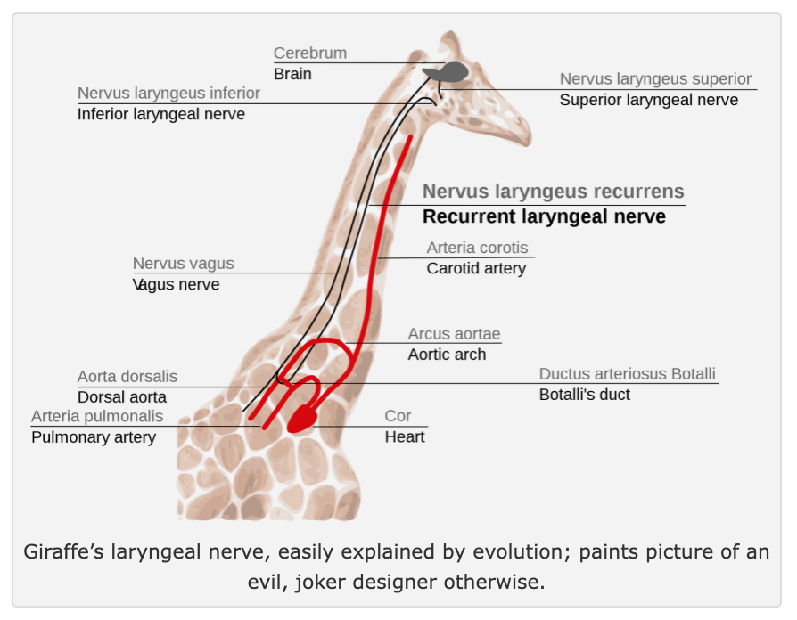

*How to Build a Brain over promised and under delivered but I appreciate its ambitious goal to “build a brain” and the efforts made towards it.*

---

Author Chris Eliasmith uses ideas from Vector Symbolic Architectures (VSAs) and implements them with his Neural Engineering Framework (NEF) to make his "brain" *somewhat* biologically plausible. He uses this combination to solve a number of different tasks and replicate some core psychology and neuroscience experimental results.

The book provides useful context about other attempts in computational neuroscience to build a brain and highlights the promise of VSAs to bridge many of the apparent dichotomies between previous approaches. In focusing at the scale of building a brain, Eliasmith also drags the microscopic and myopic back to the terminal goal of building minds and developing solutions that work at scale.

Chris Eliasmith summarizes years of his research with the culmination being "[Spaun](https://www.science.org/doi/10.1126/science.1225266)", a model of the brain with many interconnected components that can perform diverse tasks including classifying handwritten digits and solving Raven's Progressive Matrices (one of the core tests of human intelligence). This model, while certainly performing some impressive tasks, is less impressive than it first sounds, with many of the tricky details being hard coded. It's success is thanks to an impressive engineering effort, both in connecting the right pipes in the right ways, and using Eliasmith's Neural *Engineering* Framework (NEF), to implement basic VSAs and associative memory theories that had already been developed.

A big reason I was let down by the book is that I was aware of VSAs and excited to see them applied. I had hoped that some open questions I had around them would be addressed such as how a brain should decide to organize its cleanup memory, how it should represent symbols and vectors, and what variables should be bound to others. However, many of these issues were ignored just to flex the power of NEF on a number of toy problems with the really difficult parts simply hardcoded.

Additionally, I don't think Eliasmith gave previous work in these domains of VSAs and associative memory enough credit, nor did he leverage it to its full potential. For example, he presents a way to store memories through "chaining" without any citation for Plate's PhD thesis that presents and outlines this idea in detail, calling it "chunking".

In addition, for clean-up memory, he simply takes a dot product between the query and every pattern that has ever been stored. It is biologically implausible to imagine that every pattern is independently stored in the brain in this way. Far more powerful and biologically plausible systems such as SDM and even Hopfield Networks exist and should have been used instead.

Maybe I am overdoing it with my criticism here, maybe these fancier memory models could have been implemented but were not the main focus of this work. For any project, there is always finite scope. However, one thing I appreciated about the book was its prioritization of biological plausibility and this emphasis in some domains and neglect in others is frustrating. This is particularly because the biggest source of biological plausibility is the spiking neural networks implemented via NEF...

According to Greek mythology, anything Midas touched turned to gold. Here, anything that NEF touches turns to "biologically plausible". Beyond being used ineffectively to approximate functions that we know have more biologically plausible alternatives, the extent of NEF's representational power makes me skeptical of its own underlying plausibility, bringing the whole edifice it is built upon down with it.

The largest issues with the NEF are: (i) how it computes a loss function and (ii) how it propagates the error signal from this loss function to the specific subset of neurons used. The NEF takes a population of spiking neurons with random tuning curves and learns to weight them via a linear decoder such that they can approximate any arbitrary function. It is never explained[^NeedToReadNEFBook] how the arbitrary loss functions are both stored and calculated by a single decoder neuron. The error signal from this loss function is said to come from a local or external signal and mentions dopamine as maybe being this training signal but how it propagates and it targets the subset of activated neurons is highly unclear.

Again, the overall focus and ambition is refreshing but there remains much work to be done and I believe that a number of the approaches outlined in this book will need to be re-questioned and over-written in the future.

I appreciate the focus on bio-plausibility and sometimes it is very compelling but other times it seems much less justified and this brings the compelling sections into doubt.

---

**Pros of the book include:**
* Spike time dependent plasticity.
* Use of population codes.
* Reference interesting neuroscience and psychology data/benchmarks that any model should try to satisfy.
* Reference to different brain regions that may be implementing each component.

**Cons:**
* While reference to brain regions was a nice gesture, it felt very over simplified along the lines of “this component in my model should remember the start of the sequence and so we are going to call it the hippocampus.”
* Does not implement or acknowledge sparse computations in the brain. There are cases where 100 neurons are needed to represent a single scalar. Surely this is metabolically inefficient/implausible?
* NEF assumes there are lots of off neurons that fire from negative current. How common actually are these?

**Other issues with the book:**
* Logic based pre-encoding of rules to solve problems.
* Representations not being learnt, instead using random vectors - this is again hard coded and ignores the potential for symbolic relationships between concepts.
* Plate's HRR biologically plausible convolution operations taking advantage of random connectivity are a real missed opportunity.

---

**Concluding Remarks**

Given my tone and critiques throughout this review I may come as a surprise that I am really glad that this book exists and Chris Eliasmith has done the research that he has. It is a great introduction to the field of computational neuroscience and shows the exciting potential of VSAs. However, it is because this route is so exciting that I have high expectations and want for everything to be done in the most biologically plausible and sophisticated way possible with the right attributions to the right original researchers.

If you have read the book or have opinions please comment as I am curious to get outside perspectives. Hat tip to Adam Marblestone for bringing my attention to the book through [this](http://web.mit.edu/amarbles/www/talks.html) wonderful list of recommendations on his website.

---

*Thanks to [Joe Choo-Choy](https://twitter.com/joechoochoy) for influential discussions and reading drafts of this piece. All remaining errors are mine and mine alone.*

---
---
---

I will now transition from providing commentary to summarizing each chapter of the book by sharing the notes that I took for each. I’m not sure how useful this is to readers but maybe treat it as a “Table of Contents” for the book?

### Chapter 1 - Science of Cognition

I found this chapter to provide a useful high level background to computational and cognitive neuroscience, at least as of 2013 when this book was published.

There are four main approaches for modelling cognition:
        - Logic/Symbolic, Good Old Fashioned AI (GOFAI) - our thinking is logical and needs to be highly flexible as enabled by symbols.
        - Connectionist / Parallel Distributed Processing (PDP) - brain is highly parallel and distributed.
        - Dynamicist - we need to account for time and the environment.
        - Bayesian - induction and probabilistic models of the world. We need to account for uncertainty.

The two main approaches for trying to explain data can be considered top down and bottom up.
        - Production systems like ACT-R can capture high level results but have constraining time constants that are hand tuned and biologically implausible.
        - Lower level dynamics models that capture the low level phenomena but not high level cognition.

In response to these buckets, Eliasmith presents VSAs that can be logical and have nested, semantically meaningful relationships while also being dynamicist in their focus on action and implemented in a way that models both temporality, is distributed and probabilistic (Bayesian).

Eliasmith poses an interesting question apparently asked during a funding agency meeting: *"What have we actually accomplished in the last 50 years of cognitive systems research?"* Eliasmith answers saying that we have a better idea of the landscape of cognition and criteria that any intelligent system must fulfil.

 **Core Cognitive Criteria (CCC) for theories of cognition -- how to evaluate any model:**
- Representational Structure:
    - Systematicity
    - Compositionality
    - Productivity
    - Massive Binding Problem - too many variables and features
- Performance Concerns:
    - Syntactic generalization
    - Robustness
- Adaptability:
    - Memory
    - Scalability
- Scientific Merit:
    - Triangulation
    - Compactness -- Occam's razor

I also tried to answer this question myself and would be very interested in comments with answers from you, reader. Try it now! It’s a fun exercise.  

*"What have we actually accomplished in the last 50 years of cognitive systems research?"*

- Parallel Distributed Processing models -> Deep Learning.
    - Incredible performance improvements including GPT3 and DALLE
        - these empirical results suggest we might be onto something important here
    - new probabilistic models that may be crucial to cognition eg. Transformer Attention and Variational AutoEncoders
- Reinforcement learning
    - TD learning - seems to still explain dopamine reward prediction error
    - further empirical successes like winning in Go, StarCraft, Poker, driverless cars, and even with general purpose algorithms like MuZero
- Bayesian Brain/Predictive Coding/Free Energy Principle - compelling set of theories for the brain forming probabilistic models, making top down predictions (see https://slatestarcodex.com/2017/09/05/book-review-surfing-uncertainty/ for a nice review of many of these ideas)
- Vector Symbolic Architectures - Sparse Distributed Memory and Plate’s HRR in particular as connectionist ways to represent symbols that may also be a biologically plausible solution
-  Novel tools:
    - fMRI (whatever utility this provides, see After Phrenology for some critiques)
    - connectomics including of c. Elegans and exciting new results in drosophila
    - in situ RNA sequencing
    - expansion microscopy
    - many others I am unaware of...
- Novel data:
    - the amount of data we have on conditioned learning is incredible e.g. [here](http://learnmem.cshlp.org/content/10/6/427)

Obviously we have a long way to go but a great deal has been accomplished.

Eliasmith states what key questions are answered in the book, however I believe that this is overpromising and I append why to each question.

*How are semantics captured in the system?*
- Summarizes ideas from VSAs but makes no attempt to address how organisms encode hierarchical, semantic information either as sensory inputs or learned transformations. Symbols are assigned as random vectors that only have meaning to us human observers (who have already done the hard part of learning these symbols!). [Symbolic Species](https://www.amazon.com/Symbolic-Species-Co-evolution-Language-Brain-ebook/dp/B005Q65DLY) has really influenced my thinking on this.

*How is syntactic structure encoded and manipulated by the system?*
- Again, just presents ideas from VSAs on how to do variable binding, does nothing to address how a system might determine *what* should be stored and how (what should be chunked in meaningful ways).

*How is the flow of information flexibly controlled in response to task demands?*
- Uses a simplified model of the basal ganglia for action selection without much consideration for how it receives error signals.

*How are memory and learning employed in the system?*
- Rules for how to store memories and manipulate them for reasoning tasks are hardcoded, for example, solutions to Raven’s matrices and the Tower of Hanoi. This shows the usefulness of VSAs but not how representations and solutions can be learnt.

---

### Ch. 2 - Introduction to Brain Building

This chapter introduces the NEF, which I will skip as I have already written about it above. It also provides a general neuroscience background that gave me some new fun facts!

- The brain uses 20 watts of power - the same as a lightbulb!
- The brain takes up 2% of body weight but uses 25% of energy.
- Visual cortex regions are all on the surface (cortex) not nested deeper in the brain as I had originally assumed. This is a case where there are in fact connections going between different cortical columns.
- Inputs to a neuron in the cortex are on average 10K inputs and outputs. Can range from 500 (retina) to 200,000 (Purkinje).
- There are 72 kilometers (~45 miles) of fiber in the brain. This is equivalent to the height of 9 Mt. Everests...
- There are hundreds of different neurotransmitters and neuronal types.
- As an example of evolution being stuck in a local optima, giraffes have the [laryngeal nerve](https://timpanogos.blog/2011/10/08/evidence-of-evolution-giraffes-laryngeal-nerve/):
> The laryngeal nerve of the giraffe, linking larynx to brain, a few inches away — but because of evolutionary developments, instead dropping from the brain all the way down the neck to the heart, and then back up to the larynx.  In giraffes the nerve can be as much as 15 feet long, to make a connection a few inches away.

- Another example of local minima is the human retina where all of our rods and cones are [flipped the wrong way](https://theconversation.com/look-your-eyes-are-wired-backwards-heres-why-38319). This is why we have a blind spot for all the wires to enter through it.
- Human motor neurons are up to a meter long.

The next 4 Chapters outline: Semantics; Syntax; Control; Memory & Learning. These are then all combined into Spaun, the system that is meant to emulate a brain solving a number of tasks.

---

### Ch. 3 - Biological Cognition: Semantics

This chapter introduces VSAs. For a better introduction I defer to … .

VSAs are capable of implementing Hinton’s reduced representations which are:

(this is taken from Plate’s PhD thesis, he was supervised by Hinton).

A golf ball was used as a description of the high dim space that the symbols, represented as vectors, exist in. The little pockets on the ball’s surface can do clustering of similar representations.

Work is summarized on how a convolutional network can be used to learn compressed representations of MNIST digits. The quality of the compression was assessed by decoding it fixing the top layer and optimizing the input layer. This compression is suggested to be done the VSA uses superpositions/convolutions. Using NEF they also got nice Gabor like filters that we see in V1.

There is also this nice diagram for neural processing and control.
    

### Ch. 4 - Syntax
- Notes and cites work on how one to one relationships for associative learning are insufficient to solve lots of problems.
- Thinks that all transformations need to also be convolutions? Can surely still do other vector transformations that are useful?
- Dual coding theory - VSA operations are noisy. To get the perfect original vector you need to put your representation through a clean up operation. But you can also get pretty good results just working with the noisy vector. This sort of tradeoff at a high level fits well Daniel Khaneman esque System 1 vs System 2 processing.
- Hard to overstate how powerful having everything remain the same dimensionality is.
- Capacity for error and noise in VSAs is what makes them cognitively plausible!!
- NEF assumes that neurons work in a continuous space and with a rate code.
- How VSAs implemented in the brain is still v much an open problem. where and how.
- Seem to use the Fourier transform HRR model here. Why? And how are the complex numbers represented?
- pg. 133 back of envelope calculations on the number of neurons needed for a binding operation to be implemented. It is 140K neurons for two 500D vectors. This fits roughly with the number of neurons in a cortical column. But again depends also on dendritic processing capabilities and if NEF is actually being implemented.
- Neurons connect with approx 5% of others in the region it can extend to.
- Note that this binding structure can be reused many times.
- Later on it is noted that the spiking implementation does a form of soft regularization that is powerful!
- Decide on HRR because continuous representation. Note there may be others and should explore and compare more
- Able to learn a given transformation in an online setting. This looks very similar to the Perceptron update rule.
- One step reading from cleanup memory. Emphasis on this but later talk about chunking without acknowledging the need for sequential decoding.
    - Totally ignores bio plausibility.
    - Also continuous SDM ~= Attention and Hopfield paper showed you then get convergence in one step so this approach is unnecessary?  
    - Also makes sense that convergence times should change depending on the memory. Eg. Tip of the tongue phenomenon that Kanerva writes about!
     - Ravens Progressive Matrices - learn the pairwise transformations, average over them. can then use this transform to predict the next.
    - Reasoning by induction, able to generalize across objects and out of sample
    - Gets very similar results as humans which is very cool.
    - Do they get the same ones right and wrong?
    - This the same kind of reasoning by induction that [[Hyperdimensional Computing]] uses.
    - But did use random vectors and hard coded the reasoning rules…
- Chaining is a copy of Plate’s chunking with no citations for it.

### Ch. 5: Control
- Basal Ganglia is the controller deciding how to route information and doing so through the Thalamus (probably does more things too but unclear what). In particular it takes an argmax of the possible actions and returns only one. Uses a double inhibition mechanism to release one of the possible actions from the thalamus
- In this case treat it as an argmax giving a one hot encoding that the thalamus then applies to a matrix of possible vectors so it selects only one of them!
- If statement in the form of similarity dot product between different options depending on what the current vector is.
- Used to solve the Tower of Hanoi but only because all of the rules are worked out and used to solve it
- Does fit lots of bio data in performance and fMRI esp. once added working memory model for what was currently being tracked.

Some nice diagrams of basal ganglia action selection:

         

- Chains of action need the BG but not single actions?
- All cortical areas aside from primary visual and auditory project to the basal ganglia.
- All BG output goes through the thalamus before going back to the corex. Also the thalamus gets inputs directly from every sense except smell. Closed loops with all parts of the cortex.
- Reticular nucleus of the thalamus forms a kind of shell around it, kind of like a meta thalamus.
- Attention:
    - goes through a separate neural circuit that then connects to the PIT at the top of the visual processing pathway and then goes all the way down it back to the LGN.
        - it amplifies some of the signals that are coming up so they fill the whole receptive field to still utilize it
        
    - how attention is implemented in a cortical column. recall that all visual areas are part of the cortex.
        - TD and BU are top down and bottom up.
            - 
- are able to replicate results with changes in attention for a moving grating?
- can use basal ganglia to move sequentially through the alphabet and load into memory a question vs an answer and divert resources in the right way.
- able to replicate rats learning different utility functions. Here they are putting utilities directly into the BG. Later next chapter with their learning rule can replicate rats learning which bandit levers and their rates of switching.
- Able to use this to then solve the Tower of Hanoi. Given the algorithm to solve it. The timing of each operation when given working memory does very closely model that of humans.
- BOLD signal comes from dendritic processing driven by neurotransmitter usage, not neural activity. pg 198. able to use this to replicate brain regions that are active.

### Ch. 6 - Memory and Learning
- Basic memory system is a leaky integrator - stores whatever was most recently put in until the next thing arrives.
- Using two memory modules one to remember the first things put in (episodic, hippocampus) and last things (working memory, cortex) in order to reproduce the U shaped curve of remembering sequential facts.
- Also able to replicate confusion between more similar objects and non sequential data that seems to use the same sequential learning system.
- For learning they just have the NEF and plug in a Hebbian like error signal that can cone from a local or external signal, refer to dopamine as maybe being this training signal but how it propagates and is targeted enough is highly unclear.
    - Use this to learn a convolution where the circular convolution is the output transformation that it then needs to optimize...
    - Is very nice they use spike time dependent plasticity with actual spike trains and account for LTP vs LTD. and they are able to replicate this.
- **turns out their model is better to the human data than the dynamic equations because of the soft regularization that occurs on the HRR vectors!**
    - **This is because neurons will saturate for very large vector values!**
        - This is less optimal but emerges from the model (also don't need to do explicit normalization) and replicates the human data. Cool.
- Neurons synaptic weights do not increase indefinitely. Theorize there is some sort of normalization across the weights that happens?
    - SSC depression piece suggested that this happens during sleep and this is why for treatment resistant depression sleep deprivation works for 70% of them. Also feel better in the evenings, worse in the morning. and serotonin levels may affect this hence why it helps.
        - What are the bounds on the strengths of synaptic connections?
- Ability to do vector binding only appears at age 4. "many of the more cognitive behaviors that require binding are not evident in people until about the age of 3 or 4 years eg. analogy in language."
- updated routing diagram that also incorporates in the dopamine signalling:
    

- able to replicate learning the rat lever task.
- used to solve Wason logical cards. Need to test the rule holds and is unique by choosing two different cards and we succeed in the applied example but not the abstract one. Refers to social contract theory. but there seem to be plenty of other theories for why this result is the case. Train their optimizer on these examples and shows it can reproduce them, also that it can generalize to other examples in a social or abstract setting, but this is not surprising given the HRR semantics encoded in these different examples!
- Robust to pruning up to 33% but does this also mean their model originally had too many neurons to represent each of these scalars?
- Also an example of generalization benefitting from a few examples of Wason cards before then getting diminishing returns.

I NEED TO FINISH ADDING NOTES HERE ON THE REMAINING CHAPTERS.

---

---

### Footnotes
* footnotes will be placed here. This line is necessary
{:footnotes}

[^NeedToReadNEFBook]: Disclaimer that I have not read the original Neural Engineering Framework book and would love to be corrected if any of my understanding of it is incorrect.
