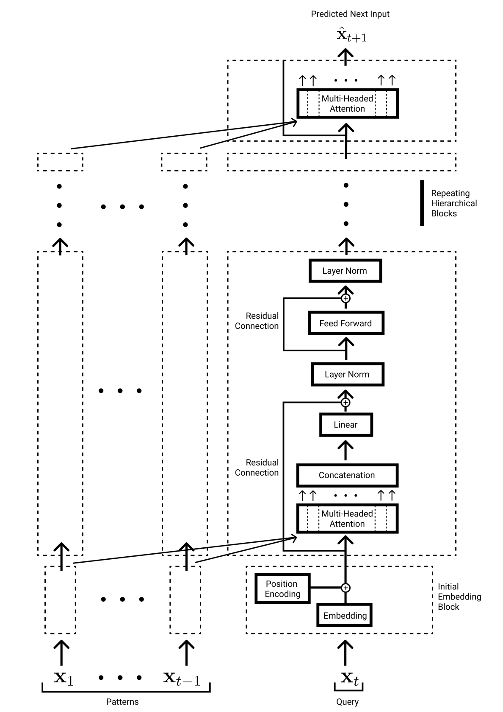

*Working out how much memory it takes to train a Transformer GPT2 Model.*

---

There has been recent discussion on [StackOverflow](https://stats.stackexchange.com/questions/563919/formula-to-compute-approximate-memory-requirements-of-transformer-models) and [Twitter](https://twitter.com/MishaLaskin/status/1546994229674647553?s=20&t=0gkdvE1j_363D3xvTT1d4A) on the full memory requirements of training a Transformer.

Because I am in the process of training Transformers myself and scaling to multiple GPUs, I became interested in this question myself. Misha Laskin provides some [back of the envelope](https://twitter.com/MishaLaskin/status/1546994229674647553?s=20&t=0gkdvE1j_363D3xvTT1d4A) calculations for why batch size and sequence length dominate over model size that are interesting but off by approximately 4x for the model parameters and 2x for activations.

I have thrown together a more detailed calculator as a Colab notebook [here](https://colab.research.google.com/drive/1G0OabelIWifPfYgoVmUFhr3hKODSHe6a?usp=sharing). And outline my reasoning below. I've tested this on the "small" 124M parameter and "medium" 345M parameter GPT2 models and get close to the real values.

Here is the GPT2 model architecture (image taken from my [paper](https://arxiv.org/abs/2111.05498)):

<div align="center">
  
</div>

See the [Illustrated GPT2](https://jalammar.github.io/illustrated-gpt2/) for a full explanation of how GPT2 works.

Here are the equations and notation in full:

```
L = 12 # number of blocks
N = 12 # number of heads
E = 768 # embedding dimension
B = 8 # batch size
T = 1024 # sequence length
TOKS = 50257 # number of tokens in the vocab
param_bytes = 4 # float32 uses 4 bytes
bytes_to_gigs = 1_000_000_000 # 1 billion bytes in a gigabyte

model_params = (TOKS*E)+ L*( 4*E**2 + 2*E*4*E + 4*E)
act_params = B*T*(2*TOKS+L*(14*E + N*T ))
backprop_model_params = 3*model_params
backprop_act_params = act_params
total_params = model_params+act_params+backprop_model_params+backprop_act_params=4*model_params+2*act_params
gigabytes_used = total_params*param_bytes/bytes_to_gigs
```

For the "small" GPT2 model with 124M parameters (that uses the above values for each parameter) we get:
```
model_params = 123,568,896
act_params = 3,088,334,848
gigabytes_used = 26.6 Gb
```

While running the Hugging Face GPT2 we get 27.5Gb.

If our batch size is 1 then we undershoot again where memory is predicted to be 5.1Gb but in reality it is 6.1Gb.

For the medium sized 345M parameter model and a batch size of 1 our equation predicts that there it will use 12.5Gb while empirically it is: 13.4Gb. The 1Gb gap remains. I learned that this 1Gb gap comes from loading the GPU kernels into memory! See [here](https://huggingface.co/docs/transformers/perf_train_gpu_one).

The model parameter equation comes from:
```
(TOKS*E) [embedding layer ]+ L [number of blocks]*( 4*E**2 [Q,K,V matrices and the linear projection after Attention] + 2*E*4*E [the MLP layer that projects up to 4*E hidden neurons and then back down again] + 4*E [Two layer norms and their scale and bias terms])
```
Where we ignore the bias terms and positional embedding.

The activation parameter equation comes from:
```
B[batch]*T[seq. length]*(2*TOKS [one hot vectors at input and output]+L[number of blocks]*(3E [K,Q,V projections] + N*T [Attention Heads softmax weightings] + E [value vector] + E [linear projection] + E [residual connection] + E [LayerNorm] +4E [MLP activation]+E [MLP projection down]+E[residual]+E[LayerNorm] ))
```

When I turn on floating point 16 the memory for 1 batch only drops from 6.1Gb to 5.8Gb. Meanwhile for a model with a batch of 8, it goes from 27.5 to 21.8Gb. Why are there not larger memory savings? Is this because it is mixed precision and the model decides that it needs high precision for many of its components?


---

*Thanks to [Miles Turpin](https://twitter.com/milesaturpin) and [Misha Laskin](https://twitter.com/MishaLaskin) for motivating this piece. All remaining errors are mine and mine alone.*

---
