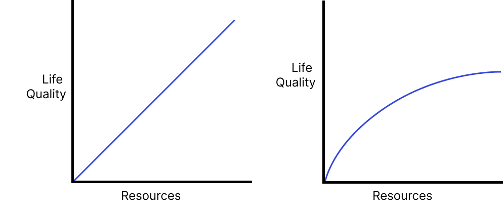
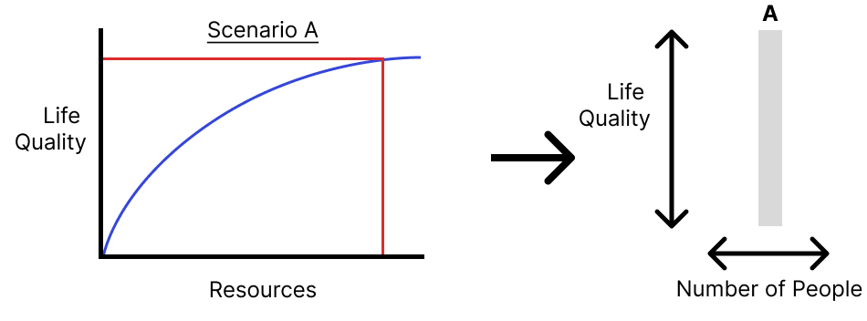
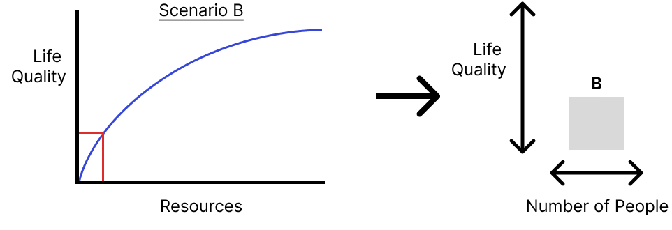
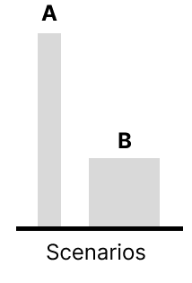
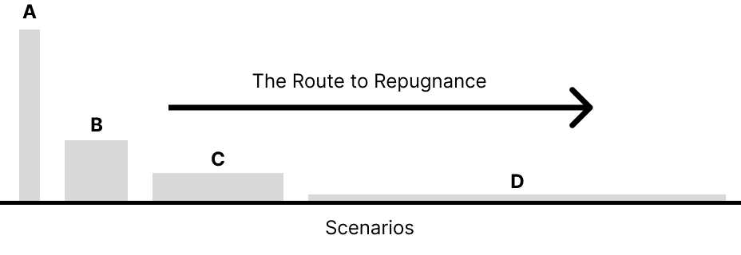
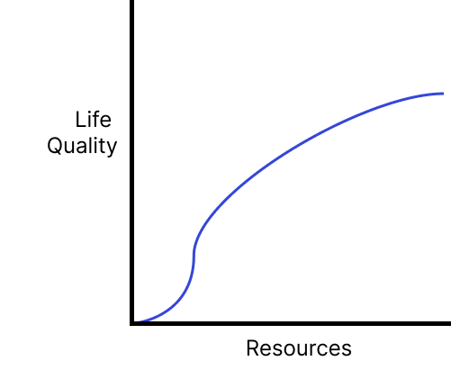

*Having a non-linear uptick in utility avoids the Repugnant Conclusion.*

---

*Disclaimer: I am not a philosopher, I very much welcome comments and debate on this piece. I am trying to not let perfect be the enemy of good and share this piece somewhat unfinished rather than continuing to sit on it.*

Derek Parfitt in Reasons and Persons introduces the [“Repugnant Conclusion”](https://en.wikipedia.org/wiki/Mere_addition_paradox) which is an unsettling answer to the question: “should we have more people or happier people?” Parfitt persuasively argues from a few simple axioms that the answer to this question is always quantity over quality and that we should have as many people alive as possible, such that everyone is living right on the threshold of life not being worth living. In other words:

> “For any perfectly equal population with very high positive welfare, there is a population with very low positive welfare which is better, other things being equal.” - Derek Parfitt

Many, myself included, find the idea of this subsistence level living repugnant, hence the name of Parfitt’s conclusion. However, I think there is actually a simple solution to the Repugnant Conclusion that I will outline after better formalizing it.  

Parfitt considers the utility function of individuals as either being linear or non-linear with diminishing returns:

  
   
  <em>Linear or diminishing returns between resources and life quality gains.</em>

The diminishing returns case is the most realistic and in this case any increase in resources on the x axis can give only equal or less than equal returns on quality of life. We can use this utility function to consider the utility of a whole population, deciding the amount of resources that each person gets and summing together their quality of life:

  
   

  
   

Comparing the areas of the rectangles on the right:

  
   

We want the one with the largest area and due to our utility function having diminishing returns, the way to maximize area is by having everyone live just above subsistence:

  
   

This always results in the repugnant conclusion where we choose quantity over quality for the sake of maximizing total utility.

However, I think there is a solution that isn’t repugnant and in fact leverages the very nature of us seeing this conclusion as repugnant – there is a point where a small increase in resources leads to an even larger increase in life quality. In other words, when life goes from glass half empty to glass half full; when you are sufficiently far above subsistence that life gets a lot more enjoyable. Exactly where this point occurs and how large this non-linear increase in quality of life as a function of resources is remains up for debate. Yet as long as any non-linearity of this form exists, the repugnant conclusion will be avoided. Formally, as long as this non-linearity with a positive 2nd derivative exists and the utility function is monotonically increasing, it dissolves the repugnant conclusion.

  
   
  <em> The non-repugnant utility function of life? </em>

This is because at this non-linearity, for a decrease in resources, there is an even greater decrease in life quality. This means that in order to maximize the utility of a population, nobody’s resource allocation and quality of life should drop below this non-linearity.

I am curious to know if this non-linearity already exists in the literature and what might be wrong with it. It is such a simple modification and I was frustrated that Parfitt never addressed it in his magnum opus. [Tamay](https://twitter.com/tamaybes) noted that one known occurrence of this sort of asymmetry in utility exists with [Prospect Theory](https://en.wikipedia.org/wiki/Prospect_theory), where losses hurt more than wins.

---

### Related Work
[What Do We Learn from the Repugnant Conclusion?](https://www.jstor.org/stable/2382033) by Tyler Cowen reviews many papers that came out after Reasons and Persons introduced the Repugnant Conclusion. Most related is his section titled “Asymmetric Treatment for Low-Utility Individuals”. However, this section discusses placing bounds on the utility function which is not done here.

In other places there is discussion of having asymptotically declining utilities that tend towards zero and may be non-linear. This violates axiom 4 of the repugnant conclusion:

>  Axiom (4) - No value should become infinitely small in importance at the margin. A very large addition to that value, all other things being held equal, should never translate into an asymptotically insignificant contribution to the social welfare function. I call this the non-vanishing value axiom.

However, the solution proposed does not rely upon an asymptotic decline of the utility function to a value of 0. Instead, it could intersect the y-axis at a value higher up, the only thing that matters is that non-linearity with a positive 2nd derivative exists somewhere.

Cowen also summarizes work where interaction effects are modeled such that a decrease in resources per person leading to a reduction in, say, dignity, and it is the effects on dignity itself that causes a decrease in utility such that we should avoid the repugnant conclusion. He provides a number of attacks against these kinds of interaction effects. However, fundamentally there is clearly an interaction effect between resources and life quality and life quality itself is the sum of many components. Having an interaction between resources and these components therefore seems inevitable? Yet, more work needs to be done to suggest where the non-linearity I suggest actually comes from.

---

### Summary

For the utility function that describes the average persons' life, as long as there exists a point where a one unit increase in resources leads to greater than one unit increase in life quality, the Repugnant Conclusion is not reached. The source of this non-linearity is unclear but at risk of being tautological, may exist due to the very fact that the Repugnant Conclusion feels so repugnant.

---

*Thanks to [Tamay Besiroglu](https://twitter.com/tamaybes) and [Davis Brown](https://twitter.com/davisbrownr) for reading drafts of this piece. All remaining errors are mine and mine alone.*
