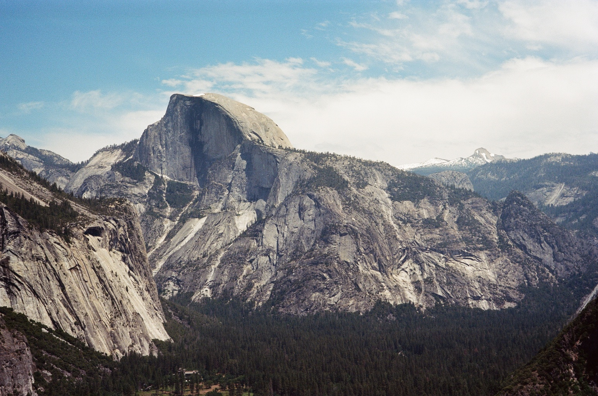
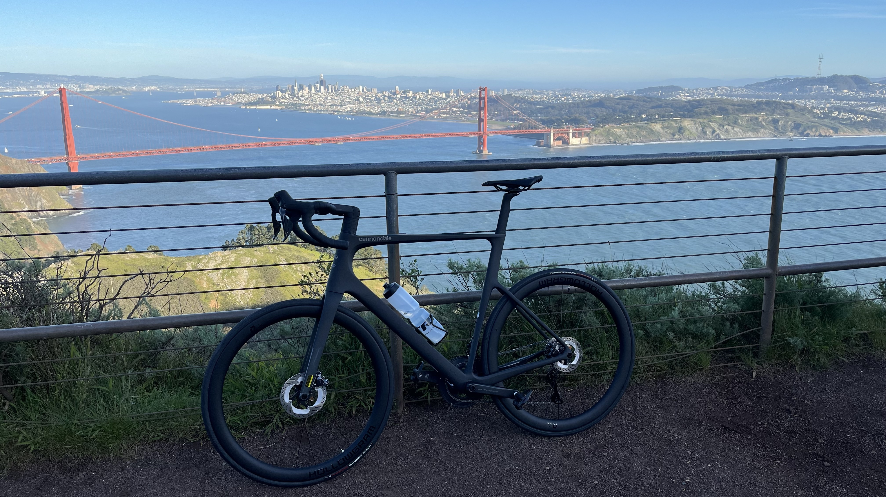
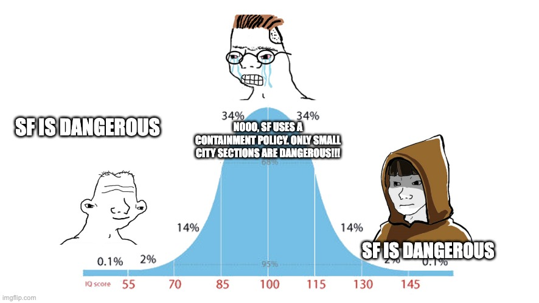
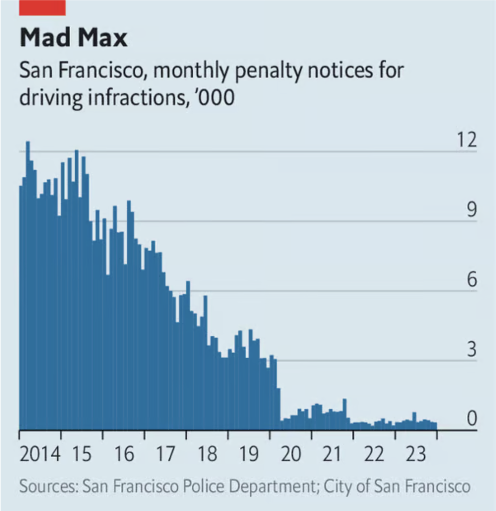

*Slouching towards Bethlehem.*

---

“Do you like San Francisco?” Always makes me pause because my feelings can’t be easily summarized. If you forced me to give a sound-bite it's that San Francisco is an amazing city with a dark underbelly.

The city is beautiful and its access to nature is world class. Within thirty minutes you can be surfing in the Pacific, biking through the Marin headlands, or looking at real live bison(!) in Golden Gate Park. Within a few hours, you can be spearfishing in Monterey, summiting Half Dome in Yosemite, or gazing upon many of the world’s largest trees in Sequoia.

  
   
  
   
  
   

 

San Francisco is also the beating heart of technology. It may be hubristic to say, but at times it feels like unless you’re doing tech in SF then you aren't serious about it.

Sometimes this tech focus can make SF feel like a monoculture, but it is of the finest vintage. With roots in the hippie movement, the monoculture also embraces weirdness in a way that translates into ambitious startups and bizarre side projects. Some examples that readily come to mind include [DIY water cooled mattresses](https://near.blog/the-1-8th-sleep/), [cars powered by really bright light](https://www.lightcellenergy.com/), [ultrasound modulation of the brain](https://www.nudge.com/), and basically every AI company.

If you are patient for the right events, most major artists make a stop and the electronic scene is excellent. The weather is cool and Mediterranean year-round and there will be so many sunny days you’ll stop even noticing them. Just always have a light jacket with you for the evenings.

SF sounds pretty great right? Fantastic tech career opportunities, beautiful nature, and a half decent nightlife. But below the surface there is a dark underbelly of tragic homelessness, bureaucratic dysfunction, and crime. Every day feels like a small roll of the dice that could eventually land badly.

If you don’t live in SF you may be saying “yeah duh!” but I myself went through the progression below:

  
   

With the levels of homelessness, disorganized law enforcement, and inequality, it seems almost inevitable that it would be this way.

I have close ties to London, Boston, and New York, and I’m aware of many more random bad things happening to wealthy, well-to-do people in SF than in any other city. Maybe this is anomalous and I’m overreacting but here are some examples:

* Nat Friedman shared his story:

<blockquote class="twitter-tweet">
We moved out of San Francisco to Menlo Park a year ago after two meth addicts broke into our house while we were home and robbed us. They are both free now. The police who arrested them -- and were later forced to release them by the DA -- said these criminals were &quot;frequent…
&mdash; Nat Friedman (@natfriedman) <a href="https://twitter.com/natfriedman/status/1644736970139267072?ref_src=twsrc%5Etfw">April 8, 2023</a></blockquote> 

* A wealthy tech couple I know had their home broken into in the Marina (a safe nice neighborhood). They woke up with the police at their bedroom door yelling for them to evacuate the house because the criminal was still inside the house. He had duct taped shut the front and garage doors and was planning to do who knows what.

* An Big Tech employee was walking home through the Mission and got clubbed in the back of the head by a homeless person. They were concussed and out of work for at least six months.

Lastly, someone close to me was in a bike lane and got hit by a moving truck that illegally turned on a red light. It is no surprise that the police and medical systems in the US are dysfunctional but the degree to which this is shown in the following story seems unique to SF.

The fact they got hit by a truck in SF doesn’t seem like a coincidence when you look at [traffic enforcement](https://www.economist.com/finance-and-economics/2024/02/12/san-franciscos-surprising-comeback):

  
   

After the incident, the underbelly of the system was laid bare to behold. The police officers who responded to the emergency claimed there was no CCTV footage of the accident, which would have proved the light was red. Returning to the scene, I found a CCTV camera directly above the location of the scene. Sharing this with law enforcement, they had zero way of figuring out who actually owned the camera. One officer literally called me asking if I could send emails to various branches of the city government because he was too overloaded and outreach from me was as good as from the police department!

I think I called over a dozen different city departments as a Byzantine nightmare unfolded. The Devil has a special place in hell where sinners have to call one government branch, be told to call another one, be given a wrong number, call back to get the correct number, be put on hold at the other branch, only to asked if they have tried calling the very branch that referred them! When I finally tracked down which obscure department owned the camera it turned out it was all for naught because the camera was only for live traffic footage and didn’t record.

<blockquote class="twitter-tweet">
SF folks, any ideas for how to figure out who owns this security camera at the intersection of 2nd Street and Harrison?   It recorded a serious accident and is likely to auto-delete the footage soon.   The police don’t know, SF MTA says it isn’t theirs, EastCut and YB neither… <a href="https://t.co/nYxfODozWr">pic.twitter.com/nYxfODozWr</a>
&mdash; Trenton Bricken (@TrentonBricken) <a href="https://twitter.com/TrentonBricken/status/1819517197393580099?ref_src=twsrc%5Etfw">August 2, 2024</a></blockquote> 

 

The worst dysfunction was inside the hospital and went beyond the general horrors of the US medical system. Even with multiple fractures and an inability to lift themselves out of bed, the person couldn’t be admitted for pain management because this route of admission had been abused so many times by the SF homeless community. Getting admitted based upon pain management provides a de facto free supply of opioids and makes it very hard for the hospital to discharge you. Because of this refusal to admit, a parade of increasingly hostile nurses would appear every 12 hours and try to get the injured person to get out of bed and into outpatient care. This only resulted in pain-induced vomiting and almost passing out from a plummeting blood pressure.

Maybe now you have an idea of why I struggle to give a sound-bite for SF. SF is wonderful, SF is weird, SF is lawless. I plan to keep living here for the foreseeable future. The combination of being at the heart of the AI takeoff and incredible nature makes it a great place to be for now. But sometimes it does feel like a roll of the dice.

---

*Thanks to [Max Farrens](https://twitter.com/lord_applebee) for giving feedback on this draft. All remaining errors are mine and mine alone.*
