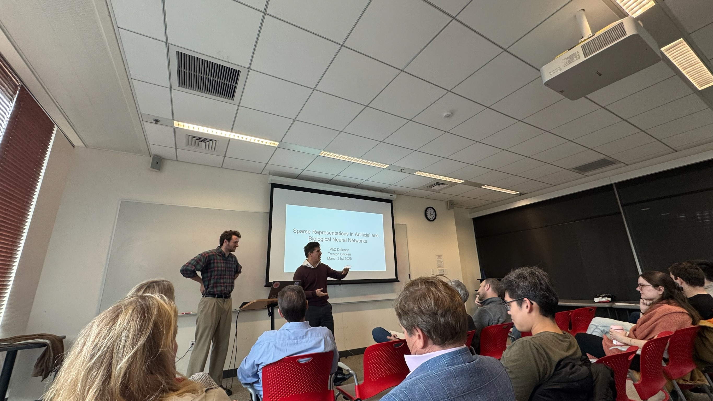

*Or how I got a PhD in two years and three months.*

---

This piece is not meant to provide any concrete advice and I don’t know how much of my story is replicable. Consider it an existence proof for what completing a PhD can look like and in the vein of “[you can just do things](https://milan.cvitkovic.net/writing/things_youre_allowed_to_do/)”.

 

  
   
  <em>My PhD Advisor, Dr. Gabriel Kreiman, introducing me at the defense.</em>

 

The Story:

I successfully defended my PhD at Harvard last month. I had been on leave of absence for over two years and was en route to dropping out – in fact most people thought that I already had.

<blockquote class="twitter-tweet">
Most people thought I&#39;d dropped out of my PhD -- including me!  But I&#39;m actually defending it this Monday, March 31st, from 12:15-1:15pm at Harvard. DM me to ask for the location or Zoom link.  Note that most of the talk will be on my previous computational neuroscience research,… <a href="https://t.co/X014wcydNX">pic.twitter.com/X014wcydNX</a>
&mdash; Trenton Bricken (@TrentonBricken) <a href="https://twitter.com/TrentonBricken/status/1905682006358507659?ref_src=twsrc%5Etfw">March 28, 2025</a></blockquote> 

 

Dropping out was the totally reasonable next step. I had only been in my PhD program for a bit over two years (American PhDs take ~5 years on average) and was unwilling to become a full time student again to take a required course.

However, a confluence of factors came together to make finishing the PhD possible:

First, I published just enough during my PhD – first author publications at top venues are the most valuable currency of graduate school. I accumulated enough of this currency (three papers) to show that I can do research and write a thesis.

Second, I continued my [research trajectory](https://scholar.google.com/citations?user=CP6aLusAAAAJ&hl=en) at Anthropic – if I had left research entirely, for example, by going into finance, then I’m almost certain I would not be granted the degree. Instead, while my Anthropic research was not affiliated with my PhD program, it very clearly continued the same vein of research that my advisor and committee acknowledged.

Third, my PhD program’s co-director was especially progressive. I chose my PhD program (Systems, Synthetic, and Quantitative Biology) because it was very flexible, having the fewest course requirements and allowing you to join labs in other departments. I vividly remember during our first day the program’s co-director saying in his wonderful British accent, “I don’t care what you do, as long as you do the best *beeping* research that you can.” I feel like I have stayed true to this — Anthropic was the best place for me to further pursue my research — and he saw and respected this which resulted in (after a two year stalemate!) waiving my final course requirement.

Finally, my PhD advisor, Dr. Gabriel Kreiman, was fully in support of me defending. Gabriel is an incredibly kind and supportive advisor who truly wanted the best for me, even when it was not what was best for him or his lab. He supported me working remote from Costa Rica during Boston’s winters, moving to California as a visiting researcher at Berkeley’s Redwood Theoretical Neuroscience Institute, and turning down the NSF Fellowship to join Anthropic. If Gabriel was not supportive of me graduating I simply would not have been able to.

Again, I really think I got lucky here and threaded the needle. I don’t know what lessons can be generalized from my story here. But maybe my experience can serve as one datapoint that if you just do the best *beeping* research you can, that everything else might fall into place.

---

*Thanks to [Max Farrens](https://twitter.com/lord_applebee) for giving feedback on this draft. All remaining errors are mine and mine alone.*
